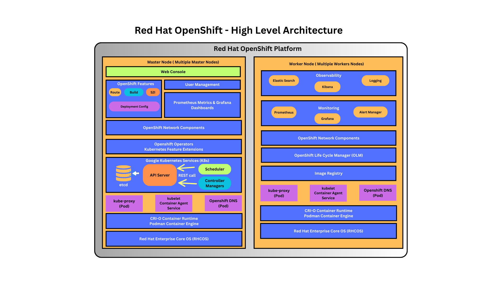
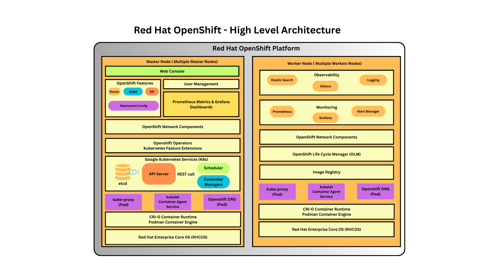

# Day 1

## What is dual-booting or multi-booting?
- Let's say we have a laptop with Windows 10 pre-installed and we need to do some prototype in Ubuntu
- You can use a system utility called Boot Loader like LILO, Grub 1, Grub2
- When we install boot loaders it gets installed in your hard disk Master Boot Record(MBR) - Sector 0, Byte 0 in your hard disk (512 bytes)
- When we boot our machine, BIOS POST (Power On Self Test), once the BIOS is loaded, BIOS will initialize all hardwares and then it then it instructs the CPU to load and run the Boot loader application from MBR
- The boot application starts scanning for Operating Systems installed on your Hard disk(s), if it finds more than one OS then it gives a menu for you to choose which OS you wish to boot into
- Only one OS can be active at any point of time

## Virtualization Overview
- aka Hypervisor
- hardware + software technology
- Processors
  - AMD ( Virtualization Feature is called AMD-V )
  - Intel ( Virtualization Feature is called VT-X )
  - Apple Silicon (ARM Processor)
- through virtualization we can run multiple operating systems side by side on the same laptop/desktop/workstation/server
- many OS can be actively running on the same machine 
- Virtualization can be enabled/disabed on the BIOS level if the system has a Processor that supports Virtualization
- you can install Hypervisor
- Examples
  - Oracle VirtualBox ( Type 2 -Windows, Mac OS-X, Linux, Free )
  - VMWare
    - Workstation ( Type 2 - Windows & Linux, License )
    - Fusion ( Type 2 - Mac OS-X , License)
    - vSphere/vCenter ( Type 1 - Bare Metal Hypervisor, License )
  - Linux KVM (Typer 2 - Opensource & Free )
 
  - Type 1 Hypervisor
    - they are meant to be used in Workstations & Servers
    - they are called Bare Metal Hypervisor
    - They don't need a Host OS
      
  - Type 2 Hypervisors
    - they are installed on Laptops/Desktops/Workstation with some OS (Windows, Linux or Mac )
    - they depend on Host OS ( Windows, Mac, Linux )

## Processor and Packaging
- Processor has one or more CPU Cores
- Processor are packaged in 2 forms
  - SCM - Single Chip Module
    - only one Processor will be in the IC
  - MCM - Multiple chip Module
    - 2/4/8 Processors can be package in a single IC
- Examples
  - One Processor supports - 128/256/512 CPU Cores
  - MCM IC - let's take that it has 4 Processors in a single IC
  - Let's assume, each Processor supports 128 CPU Cores
  - Generally Server motherboards comes with multiple Processor Sockets ( 2/4/8 Socket Motherboards )
  - Final assumption
    - a server motherboard that supports 4 Sockets
    - each Socket is installed with MCM with 4 Processors on each IC
    - Processor - 128 CPU Cores
    - Total CPU Core - 4 Sockets x 4 x 128 = 2048 CPU Cores
    - Total logical cores - 2048 x 2 = 4096 virtual cores in a single server
  - Hypertheading
    - each Physical CPU core supports 2/4/8 threads i.e logical/virtual CPU Cores
  - each Operating Systems runs in a separate Virtual Machine
  - Virtual Machines are also referred as Guest OS
  - each Virtual Machine represents one Operating System
  - Each Virtual Machine requires dedicated hardware resources, hence called heavy-weight virtualization
    - dedicated hardware resources
      - CPU
      - RAM
      - Storage

## Containerization
- application virtualization technology
- each container represents one application process
- container is not an Operating Sytem
- container has one application and its dependent libraries
- normally application processor will not get an IP address
- but containers get an IP Address
- container has their own file system ( files & folders )
- container has their own network stack with software defined network card
- light-weight virtualization
  - reason being, containers shares the hardwares on the underlying host operating systems
  - containers also shares the host-os Kernel
  - containers doesn't have their own kernel
- containers won't be able to replace a Virtualization technology
- while containers hosts a single application, VM hosts an Operating System. Hence, they are complementing technogy not competing technology. They are normally used in combination, so they can and will co-exist.

## Virtualization vs Containerization
- Each Virtual Machine represents an OS while each Container represents a single application
- Each Virtual Machine gets dedicated hardware resources, while containers running on the same OS shares the hardware resources on the host OS
- Each OS running on the Virtual Machine has its own Kernel, while containers don't have their own kernel, containers depends on Host OS kernel

## Container vs Normal Application Process
- Container is nothing but a regular application process but it runs in a separate namespace
- containers 
  - has its own network namespace
  - has its Port namespace ( Port range - 0 to 65535 )

## Linux Kernel Container Features
1. Namespace
   - helps in isolating one container from other containers running on the same OS
      
2. Control Group(CGroups)
   - to ensure every container shares the hardware resources co-operatively Control Groups are used
   - if this isn't not done, at times certain containers uses all the hardwares resources leaving other containers to starve
   - helps in applying resource quota restrictions like
     - we can restrict a container on how many CPU Cores it can use at the max at any point of time
     - we can restrict how much RAM a container use at the max
     - we can restrict, how much storage a container can use at the max

## What is a Container Runtime?
- it is low-level software that manages container images and containers
- it is not so user-friendly, hence end-users like us normally won't use Container Runtimes directly
- Examples
  - runC
  - CRI-O

## What is a Container Engine?
- it is a high-level software
- it is very user-friendly
- We dont' have to know, low-level kernel stuffs to create containers
- internally it depends on Container Runtimes to manage container images and containers
- Examples
  - Docker is a Container Engine that depends on containerd which in turn depends on runC container runtime
  - Podman is a Container Engine that depends on CRI-O container runtime

## Docker Overview
- is a Container Engine
- follows client/server architecure
- the server component runs as a background service
- server component runs in root user context, hence all containers gains admin privilege
- is developed in Go language by Docker Inc organization
- comes in 2 flavours
  1. Docker Community Edition called Docker CE
  2. Docker Enterprise Edition called Docker EE (requires license)

## Docker - High Level Architecture


## What is Container Orchestration Platform ?
- containers, can be managed manually or via Orchestration Platforms
  - creating a container
  - starting a container
  - stop/restart containers
  - kill/abort containers
  - delete container
- in real world no one manages container manually, hence we a software platform that can manage containerized application workloads
- which is called Container Orchestration Platforms
- Examples
  - Docker Swarm
  - Google Kubernetes
  - Red Hat OpenShift
- the application that needs to be deployed into Container Orchestration Platforms has to be first of all containerized
- What are the benefits of using a Container Orchestration Platforms?
  - they offer in-built monitoring features to check the health of your application and repairs it your application is found faulty
  - they also support monitoring features to check the readiness and liviness of your application, if required it repairs
  - provides an environment where you application can be made Highly available (HA)
  - When the user traffic to your containerized application increases, container orchestration platform can automatically scale it up i.e more instances of your application to handle heavy traffic
  - when the user traffic to your contianerized application decreases, container orchestration platform can automatically scale it down,.ie remove extra application instances which are idle
  - supports rolling update
    - is used to upgrade/downgrade your application from one version to other version without any down time
  - supports many different types of services to expose your application via Service abstraction ( service discovery )
    - internal services 
    - external services
- supports in-built load balancing
Examples
1. Docker Swarm
2. Google Kubernetes
3. Red Hat OpenShift

## Docker Swarm - Container Orchestration Platform
- this is Docker's native Container Orchestration Platform
- supports only Docker Containerized Application workloads
- it is easy to install and learn
- it is not production grade, hence normally no company uses this in production
- it is good for light-weight developer/qa setup or for learning Orchestration concepts

## Google kubernetes 
- aka K8s
- it is developed by Google in Go language
- it is opensource & free
- it supports many container runtimes/engines
- it is production grade
- Kubernetes does support a basic Dashboard(Web Interface) but it is not secure, hence administrators normally disable this to avoid any security issues
- it doesn't support Web Interface, supports only CLI
- supports extending Kubernetes API by adding new Custom Resource Definitions (CRD) to add your own Custom Resources (CR)s

## What is Kubernetes/OpenShift Operator
- it is a package of many Custom Resource & Custom Controllers
- Kubernetes & Openshift supports many different Controllers
- Controller supports monitoring
- Each Controller manages(monitors) one type of Kubernetes/Openshift Resource

## Red Hat OpenShift Overview
- Red Hat's distribution of Kubernetes
- Red Hat OpenShift is developed on top of opensource Google Kubernetes
- Hence, whatever features are supported in Kubernetes are also supported in OpenShift
- OpenShift supports many additional features
- OpenShift supports CLI and Web Interface
- Openshift supports User Mangagement which is not supported in Kubernetes
- OpenShift supports deploying application from source code, which is not supported in Kubernetes out of the box
- OpenShift comes with private Container Registry out of the box unlike Kubernetes
- With the help of Custom Resource Definitions and CRs, OpenShift has added many additional features on top of Kubernetes
- this is a paid enterprise software that requires license
- comes with world-wide Red Hat support
- Openshift 4.x supports only CRI-O Container Runtime and Podman Container Engine
- AWS Managed OpenShift is called ROSA ( installing and managing openshift is taken care by AWS )
- Azure Managed openshift is called ARO ( installing and managing openshift is taken care by Azure )

## Red Hat OpenShift - High-Level Architecture



## What is a Pod?
- a collection of related containers
- a single application can be represented by one or more Pods
- one Pod is recommended to have one main application
- but it is okay to have supporting container(s) along the side of the main application
- user application runs inside Kubernetes/Openshift as Pod
- IP address is assigned on the Pod level, hence the containers that are part of the same Pod shares the IP address
- ports on the Pod are shared by all the containers running within the Pod

## Commonly used - Kubernetes/Openshift Resources
- Pod
- ReplicaSet
- Deployment
- DaemonSet
- Job
- CronJob
- StatefulSet
- Services
- EndPoint

## What are the Kubernetes Control Plane Components?
Kubernetes/OpenShift supports 4 Control Plane Components
1. API Server
2. etcd key/value datastore/database
3. scheduler
4. controller managers ( collection of many controllers )

The control plane components runs only in the master nodes.

#### API Server
- supports REST API for all the features supported by OpenShift
- all the Openshift components will be communicate only to API Server
- other components are not allowed to communicate with each other directly
- every components communication flows via API Server only in Kubernetes/Openshift
- API Server maintains the nodes, cluster, application status in the etcd database
- only API Server will have access to etcd database
- In our openshift cluster, 3 master nodes are there, hence 3 API Servers i.e one API Server per master node is there
- API Server sends broadcasting events whenever any update happens in the etcd database
  - new record added
  - existing record updated
  - existing record deleted
  
#### etcd database
- opensource database that can be used outside the scope of Kubernetes/openshift as well
- generally they work in groups ( cluster of etcd databases )
- it stores key/values as records
- since we have 3 master nodes, there are 3 etcd databases which works as a cluster

#### Scheduler
- this is the component that is responsible to find a healthy node where a new Pod can be deployed
- Scheduler sends its scheduling recommendataion to API Server
- API Server updates the scheduling info on each Pod stored in the etcd database
- API Server broadcasts events for each Pod deployed onto some node
- Kubelet is the container agent that runs in every node ( master and worker nodes)
- kubelet downloads the container image, creates and starts the container
- kubelet keeps monitoring the status of the container running on the local node and reports the status on a heart-beat like periodic fashion to the API Server

#### Controller Managers
- it is a collection of many controllers
- Examples
  - Deployment Controller
  - ReplicaSet Controller
  - EndPoitnt Controller
  - Job Controller
  - StatefulSet Controller
  - DaemonSet Controller
- Each Controller manages one type of Kubernetes/OpenShift resource
- For example
  - Deployment Controller manages Deployment resource
- Deployment Controller watches for events related to Deployment Resource
  - New deployment created
  - Depoyment edited
  - Deployment deleted
- ReplicaSet Controller watches for events from API Server related to ReplicaSet Resource
  - New ReplicaSet created
  - ReplicaSet edited
  - ReplicaSet deleted
  
## Lab - Checking the Openshift client version
```
oc version
```

Expected output
<pre>
[jegan@tektutor.org openshift-may-2024]$ oc version
Client Version: 4.14.12
Kustomize Version: v5.0.1
Server Version: 4.14.20
Kubernetes Version: v1.27.11+ec42b99  
</pre>

Kubernetes client version
```
kubectl version
```

Expected output
<pre>
[jegan@tektutor.org openshift-may-2024]$ kubectl version
WARNING: This version information is deprecated and will be replaced with the output from kubectl version --short.  Use --output=yaml|json to get the full version.
Client Version: version.Info{Major:"1", Minor:"27", GitVersion:"v1.27.4", GitCommit:"286cfa5f978c4a89c776347c82fa09a232eef144", GitTreeState:"clean", BuildDate:"2024-01-29T22:50:23Z", GoVersion:"go1.20.12 X:strictfipsruntime", Compiler:"gc", Platform:"linux/amd64"}
Kustomize Version: v5.0.1
Server Version: version.Info{Major:"1", Minor:"27", GitVersion:"v1.27.11+ec42b99", GitCommit:"9654661a61cc44110a8a3a801a82482ab63d063d", GitTreeState:"clean", BuildDate:"2024-04-04T12:53:37Z", GoVersion:"go1.20.12 X:strictfipsruntime", Compiler:"gc", Platform:"linux/amd64"}  
</pre>

## Lab - Listing the nodes in the Red Hat OpenShift cluster
```
oc get nodes
kubectl get nodes
```

Expected output
<pre>
[jegan@tektutor.org openshift-may-2024]$ <b>oc get nodes</b>
NAME                              STATUS   ROLES                         AGE   VERSION
master-1.ocp4.tektutor.org.labs   Ready    control-plane,master,worker   28d   v1.27.11+749fe1d
master-2.ocp4.tektutor.org.labs   Ready    control-plane,master,worker   28d   v1.27.11+749fe1d
master-3.ocp4.tektutor.org.labs   Ready    control-plane,master,worker   28d   v1.27.11+749fe1d
worker-1.ocp4.tektutor.org.labs   Ready    worker                        28d   v1.27.11+749fe1d
worker-2.ocp4.tektutor.org.labs   Ready    worker                        28d   v1.27.11+749fe1d
  
[jegan@tektutor.org openshift-may-2024]$ <b>kubectl get nodes</b>
NAME                              STATUS   ROLES                         AGE   VERSION
master-1.ocp4.tektutor.org.labs   Ready    control-plane,master,worker   28d   v1.27.11+749fe1d
master-2.ocp4.tektutor.org.labs   Ready    control-plane,master,worker   28d   v1.27.11+749fe1d
master-3.ocp4.tektutor.org.labs   Ready    control-plane,master,worker   28d   v1.27.11+749fe1d
worker-1.ocp4.tektutor.org.labs   Ready    worker                        28d   v1.27.11+749fe1d
worker-2.ocp4.tektutor.org.labs   Ready    worker                        28d   v1.27.11+749fe1d  
</pre>

## Lab - Finding more details about an OpenShift node
```
oc get nodes
oc describe node master-1.ocp4.tektutor.org.labs
```

Expected output
<pre>
[jegan@tektutor.org openshift-may-2024]$ <b>oc describe node master-1.ocp4.tektutor.org.labs</b>
Name:               master-1.ocp4.tektutor.org.labs
Roles:              control-plane,master,worker
Labels:             beta.kubernetes.io/arch=amd64
                    beta.kubernetes.io/os=linux
                    disk=ssd
                    kubernetes.io/arch=amd64
                    kubernetes.io/hostname=master-1.ocp4.tektutor.org.labs
                    kubernetes.io/os=linux
                    node-role.kubernetes.io/control-plane=
                    node-role.kubernetes.io/master=
                    node-role.kubernetes.io/worker=
                    node.openshift.io/os_id=rhcos
Annotations:        machineconfiguration.openshift.io/controlPlaneTopology: HighlyAvailable
                    machineconfiguration.openshift.io/currentConfig: rendered-master-01924f2b385b8dcf4e042dfc0e1726ab
                    machineconfiguration.openshift.io/desiredConfig: rendered-master-01924f2b385b8dcf4e042dfc0e1726ab
                    machineconfiguration.openshift.io/desiredDrain: uncordon-rendered-master-01924f2b385b8dcf4e042dfc0e1726ab
                    machineconfiguration.openshift.io/lastAppliedDrain: uncordon-rendered-master-01924f2b385b8dcf4e042dfc0e1726ab
                    machineconfiguration.openshift.io/lastSyncedControllerConfigResourceVersion: 3115076
                    machineconfiguration.openshift.io/reason: 
                    machineconfiguration.openshift.io/state: Done
                    volumes.kubernetes.io/controller-managed-attach-detach: true
CreationTimestamp:  Tue, 16 Apr 2024 08:39:13 +0530
Taints:             <none>
Unschedulable:      false
Lease:
  HolderIdentity:  master-1.ocp4.tektutor.org.labs
  AcquireTime:     <unset>
  RenewTime:       Tue, 14 May 2024 14:04:56 +0530
Conditions:
  Type             Status  LastHeartbeatTime                 LastTransitionTime                Reason                       Message
  ----             ------  -----------------                 ------------------                ------                       -------
  MemoryPressure   False   Tue, 14 May 2024 14:01:21 +0530   Tue, 16 Apr 2024 08:39:13 +0530   KubeletHasSufficientMemory   kubelet has sufficient memory available
  DiskPressure     False   Tue, 14 May 2024 14:01:21 +0530   Tue, 16 Apr 2024 08:39:13 +0530   KubeletHasNoDiskPressure     kubelet has no disk pressure
  PIDPressure      False   Tue, 14 May 2024 14:01:21 +0530   Tue, 16 Apr 2024 08:39:13 +0530   KubeletHasSufficientPID      kubelet has sufficient PID available
  Ready            True    Tue, 14 May 2024 14:01:21 +0530   Tue, 16 Apr 2024 08:44:30 +0530   KubeletReady                 kubelet is posting ready status
Addresses:
  InternalIP:  192.168.122.20
  Hostname:    master-1.ocp4.tektutor.org.labs
Capacity:
  cpu:                8
  ephemeral-storage:  51837932Ki
  hugepages-1Gi:      0
  hugepages-2Mi:      0
  memory:             15991668Ki
  pods:               250
Allocatable:
  cpu:                7500m
  ephemeral-storage:  46700096229
  hugepages-1Gi:      0
  hugepages-2Mi:      0
  memory:             14840692Ki
  pods:               250
System Info:
  Machine ID:                             6dfff066b0ce42fe99fc3ccb3fbf45e3
  System UUID:                            6dfff066-b0ce-42fe-99fc-3ccb3fbf45e3
  Boot ID:                                21730e20-82ea-44a0-b2ed-5d18aa4976fd
  Kernel Version:                         5.14.0-284.59.1.el9_2.x86_64
  OS Image:                               Red Hat Enterprise Linux CoreOS 414.92.202403270157-0 (Plow)
  Operating System:                       linux
  Architecture:                           amd64
  Container Runtime Version:              cri-o://1.27.4-6.1.rhaos4.14.gitd09e4c0.el9
  Kubelet Version:                        v1.27.11+749fe1d
  Kube-Proxy Version:                     v1.27.11+749fe1d
Non-terminated Pods:                      (45 in total)
  Namespace                               Name                                                              CPU Requests  CPU Limits  Memory Requests  Memory Limits  Age
  ---------                               ----                                                              ------------  ----------  ---------------  -------------  ---
  knative-serving                         controller-678994f5d7-98g4h                                       110m (1%)     1 (13%)     120Mi (0%)       1000Mi (6%)    22d
  metallb-system                          speaker-tfppc                                                     20m (0%)      0 (0%)      40Mi (0%)        0 (0%)         3d11h
  openshift-apiserver                     apiserver-7dbf8d7788-6nb59                                        110m (1%)     0 (0%)      250Mi (1%)       0 (0%)         28d
  openshift-authentication                oauth-openshift-58dc999844-nq769                                  10m (0%)      0 (0%)      50Mi (0%)        0 (0%)         28d
  openshift-cluster-node-tuning-operator  tuned-6pvwx                                                       10m (0%)      0 (0%)      50Mi (0%)        0 (0%)         28d
  openshift-console-operator              console-operator-647c75b967-8qtvn                                 20m (0%)      0 (0%)      200Mi (1%)       0 (0%)         28d
  openshift-console                       console-7644f4994f-gm8qk                                          10m (0%)      0 (0%)      100Mi (0%)       0 (0%)         28d
  openshift-console                       downloads-86d9bcf76d-9tmjm                                        10m (0%)      0 (0%)      50Mi (0%)        0 (0%)         28d
  openshift-controller-manager            controller-manager-746fc45899-xx9m4                               100m (1%)     0 (0%)      100Mi (0%)       0 (0%)         3d11h
  openshift-dns                           dns-default-47l8t                                                 60m (0%)      0 (0%)      110Mi (0%)       0 (0%)         28d
  openshift-dns                           node-resolver-c6njj                                               5m (0%)       0 (0%)      21Mi (0%)        0 (0%)         28d
  openshift-etcd                          etcd-guard-master-1.ocp4.tektutor.org.labs                        10m (0%)      0 (0%)      5Mi (0%)         0 (0%)         28d
  openshift-etcd                          etcd-master-1.ocp4.tektutor.org.labs                              360m (4%)     0 (0%)      910Mi (6%)       0 (0%)         28d
  openshift-image-registry                image-registry-7d9d675f88-lc6p2                                   100m (1%)     0 (0%)      256Mi (1%)       0 (0%)         28d
  openshift-image-registry                node-ca-65qhq                                                     10m (0%)      0 (0%)      10Mi (0%)        0 (0%)         28d
  openshift-ingress-canary                ingress-canary-qxv5d                                              10m (0%)      0 (0%)      20Mi (0%)        0 (0%)         28d
  openshift-ingress                       router-default-6fbc577945-ll27k                                   100m (1%)     0 (0%)      256Mi (1%)       0 (0%)         21d
  openshift-kube-apiserver                kube-apiserver-guard-master-1.ocp4.tektutor.org.labs              10m (0%)      0 (0%)      5Mi (0%)         0 (0%)         28d
  openshift-kube-apiserver                kube-apiserver-master-1.ocp4.tektutor.org.labs                    290m (3%)     0 (0%)      1224Mi (8%)      0 (0%)         3d11h
  openshift-kube-controller-manager       kube-controller-manager-guard-master-1.ocp4.tektutor.org.labs     10m (0%)      0 (0%)      5Mi (0%)         0 (0%)         28d
  openshift-kube-controller-manager       kube-controller-manager-master-1.ocp4.tektutor.org.labs           80m (1%)      0 (0%)      500Mi (3%)       0 (0%)         28d
  openshift-kube-scheduler                openshift-kube-scheduler-guard-master-1.ocp4.tektutor.org.labs    10m (0%)      0 (0%)      5Mi (0%)         0 (0%)         28d
  openshift-kube-scheduler                openshift-kube-scheduler-master-1.ocp4.tektutor.org.labs          25m (0%)      0 (0%)      150Mi (1%)       0 (0%)         28d
  openshift-machine-config-operator       kube-rbac-proxy-crio-master-1.ocp4.tektutor.org.labs              20m (0%)      0 (0%)      50Mi (0%)        0 (0%)         28d
  openshift-machine-config-operator       machine-config-daemon-fbjr8                                       40m (0%)      0 (0%)      100Mi (0%)       0 (0%)         28d
  openshift-machine-config-operator       machine-config-server-6klv8                                       20m (0%)      0 (0%)      50Mi (0%)        0 (0%)         28d
  openshift-marketplace                   community-operators-46t78                                         10m (0%)      0 (0%)      50Mi (0%)        0 (0%)         3h33m
  openshift-monitoring                    alertmanager-main-0                                               9m (0%)       0 (0%)      120Mi (0%)       0 (0%)         28d
  openshift-monitoring                    monitoring-plugin-b889d6f95-2bjc5                                 10m (0%)      0 (0%)      50Mi (0%)        0 (0%)         28d
  openshift-monitoring                    node-exporter-khtjb                                               9m (0%)       0 (0%)      47Mi (0%)        0 (0%)         28d
  openshift-monitoring                    prometheus-adapter-d748bc674-t4vrr                                1m (0%)       0 (0%)      40Mi (0%)        0 (0%)         3d11h
  openshift-monitoring                    prometheus-k8s-1                                                  75m (1%)      0 (0%)      1104Mi (7%)      0 (0%)         28d
  openshift-monitoring                    prometheus-operator-admission-webhook-6c4c698b7d-n4p5w            5m (0%)       0 (0%)      30Mi (0%)        0 (0%)         28d
  openshift-monitoring                    thanos-querier-dc65b5668-stk8z                                    15m (0%)      0 (0%)      92Mi (0%)        0 (0%)         28d
  openshift-multus                        multus-additional-cni-plugins-tjjqm                               10m (0%)      0 (0%)      10Mi (0%)        0 (0%)         28d
  openshift-multus                        multus-admission-controller-68dfc47cb4-9sqms                      20m (0%)      0 (0%)      70Mi (0%)        0 (0%)         14d
  openshift-multus                        multus-mts72                                                      10m (0%)      0 (0%)      65Mi (0%)        0 (0%)         28d
  openshift-multus                        network-metrics-daemon-dknss                                      20m (0%)      0 (0%)      120Mi (0%)       0 (0%)         28d
  openshift-network-diagnostics           network-check-source-8c95bf67d-hckd2                              10m (0%)      0 (0%)      40Mi (0%)        0 (0%)         28d
  openshift-network-diagnostics           network-check-target-k9b77                                        10m (0%)      0 (0%)      15Mi (0%)        0 (0%)         28d
  openshift-network-node-identity         network-node-identity-s9g8r                                       20m (0%)      0 (0%)      100Mi (0%)       0 (0%)         28d
  openshift-oauth-apiserver               apiserver-5dbd945565-flzlb                                        150m (2%)     0 (0%)      200Mi (1%)       0 (0%)         28d
  openshift-route-controller-manager      route-controller-manager-7df59564f-hskwq                          100m (1%)     0 (0%)      100Mi (0%)       0 (0%)         3d11h
  openshift-sdn                           sdn-controller-rblqn                                              20m (0%)      0 (0%)      70Mi (0%)        0 (0%)         28d
  openshift-sdn                           sdn-hblrp                                                         110m (1%)     0 (0%)      220Mi (1%)       0 (0%)         28d
Allocated resources:
  (Total limits may be over 100 percent, i.e., overcommitted.)
  Resource           Requests      Limits
  --------           --------      ------
  cpu                2174m (28%)   1 (13%)
  memory             7180Mi (49%)  1000Mi (6%)
  ephemeral-storage  0 (0%)        0 (0%)
  hugepages-1Gi      0 (0%)        0 (0%)
  hugepages-2Mi      0 (0%)        0 (0%)
Events:              <none>  
</pre>

## Lab - Finding IP address, Node OS and Container Runtime details
```
oc get nodes -o wide
```

Expected output
<pre>
[jegan@tektutor.org <b>openshift-may-2024]$ oc get nodes -o wide</b>
NAME                              STATUS   ROLES                         AGE   VERSION            INTERNAL-IP       EXTERNAL-IP   OS-IMAGE                                                       KERNEL-VERSION                 CONTAINER-RUNTIME
master-1.ocp4.tektutor.org.labs   Ready    control-plane,master,worker   28d   v1.27.11+749fe1d   192.168.122.20    <none>        Red Hat Enterprise Linux CoreOS 414.92.202403270157-0 (Plow)   5.14.0-284.59.1.el9_2.x86_64   cri-o://1.27.4-6.1.rhaos4.14.gitd09e4c0.el9
master-2.ocp4.tektutor.org.labs   Ready    control-plane,master,worker   28d   v1.27.11+749fe1d   192.168.122.211   <none>        Red Hat Enterprise Linux CoreOS 414.92.202403270157-0 (Plow)   5.14.0-284.59.1.el9_2.x86_64   cri-o://1.27.4-6.1.rhaos4.14.gitd09e4c0.el9
master-3.ocp4.tektutor.org.labs   Ready    control-plane,master,worker   28d   v1.27.11+749fe1d   192.168.122.194   <none>        Red Hat Enterprise Linux CoreOS 414.92.202403270157-0 (Plow)   5.14.0-284.59.1.el9_2.x86_64   cri-o://1.27.4-6.1.rhaos4.14.gitd09e4c0.el9
worker-1.ocp4.tektutor.org.labs   Ready    worker                        28d   v1.27.11+749fe1d   192.168.122.228   <none>        Red Hat Enterprise Linux CoreOS 414.92.202403270157-0 (Plow)   5.14.0-284.59.1.el9_2.x86_64   cri-o://1.27.4-6.1.rhaos4.14.gitd09e4c0.el9
worker-2.ocp4.tektutor.org.labs   Ready    worker                        28d   v1.27.11+749fe1d   192.168.122.56    <none>        Red Hat Enterprise Linux CoreOS 414.92.202403270157-0 (Plow)   5.14.0-284.59.1.el9_2.x86_64   cri-o://1.27.4-6.1.rhaos4.14.gitd09e4c0.el9
</pre>

## Lab - Editing a node details ( don't really edit anything )
```
oc edit node master-1.ocp4.tektutor.org.labs
```

## Lab - Listing all pods(applications) on all nodes and namespaces
```
oc get pods --all-namespaces
```

## Lab - List the API Server ( one of the control plane component that runs in each master node )

In the below command, -n represents namespaces/project.

```
oc get pods -n openshift-apiserver
```

Expected output
<pre>
[jegan@tektutor.org openshift-may-2024]$ oc get pods -n openshift-apiserver
NAME                         READY   STATUS    RESTARTS   AGE
apiserver-7dbf8d7788-6nb59   2/2     Running   24         28d
apiserver-7dbf8d7788-9zkmb   2/2     Running   24         28d
apiserver-7dbf8d7788-lndws   2/2     Running   24         28d  
</pre>

In order to find the below pod IP address and the node each Pod is running, you could try the below command
```
oc get pods -n openshift-apiserver -o wide
```

Expected output
<pre>
jegan@tektutor.org openshift-may-2024]$ <b>oc get pods -n openshift-apiserver -o wide</b>
NAME                         READY   STATUS    RESTARTS   AGE   IP            NODE                              NOMINATED NODE   READINESS GATES
apiserver-7dbf8d7788-6nb59   2/2     Running   24         28d   10.128.0.8    master-1.ocp4.tektutor.org.labs   <none>           <none>
apiserver-7dbf8d7788-9zkmb   2/2     Running   24         28d   10.129.0.45   master-2.ocp4.tektutor.org.labs   <none>           <none>
apiserver-7dbf8d7788-lndws   2/2     Running   24         28d   10.130.0.48   master-3.ocp4.tektutor.org.labs   <none>          <none></pre>

## Lab - List all the projects/namespaces in Openshift
In Openshift, applications are deployed in a separate project.  Each team, will create their own project to deplooy their applications.

```
oc get projects
oc get namespaces
```

Expected output
<pre>
[jegan@tektutor.org openshift-may-2024]$ oc get projects
NAME                                               DISPLAY NAME   STATUS
aap                                                               Active
default                                                           Active
jegan                                                             Active
jegan-new                                                         Active
knative-eventing                                                  Active
knative-serving                                                   Active
knative-serving-ingress                                           Active
kube-node-lease                                                   Active
kube-public                                                       Active
kube-system                                                       Active
metallb-system                                                    Active
openshift                                                         Active
openshift-apiserver                                               Active
openshift-apiserver-operator                                      Active
openshift-authentication                                          Active
openshift-authentication-operator                                 Active
openshift-cloud-controller-manager                                Active
openshift-cloud-controller-manager-operator                       Active
openshift-cloud-credential-operator                               Active
openshift-cloud-network-config-controller                         Active
openshift-cluster-csi-drivers                                     Active
openshift-cluster-machine-approver                                Active
openshift-cluster-node-tuning-operator                            Active
openshift-cluster-samples-operator                                Active
openshift-cluster-storage-operator                                Active
openshift-cluster-version                                         Active
openshift-config                                                  Active
openshift-config-managed                                          Active
openshift-config-operator                                         Active
openshift-console                                                 Active
openshift-console-operator                                        Active
openshift-console-user-settings                                   Active
openshift-controller-manager                                      Active
openshift-controller-manager-operator                             Active
openshift-dns                                                     Active
openshift-dns-operator                                            Active
openshift-etcd                                                    Active
openshift-etcd-operator                                           Active
openshift-host-network                                            Active
openshift-image-registry                                          Active
openshift-infra                                                   Active
openshift-ingress                                                 Active
openshift-ingress-canary                                          Active
openshift-ingress-operator                                        Active
openshift-insights                                                Active
openshift-kni-infra                                               Active
openshift-kube-apiserver                                          Active
openshift-kube-apiserver-operator                                 Active
openshift-kube-controller-manager                                 Active
openshift-kube-controller-manager-operator                        Active
openshift-kube-scheduler                                          Active
openshift-kube-scheduler-operator                                 Active
openshift-kube-storage-version-migrator                           Active
openshift-kube-storage-version-migrator-operator                  Active
openshift-machine-api                                             Active
openshift-machine-config-operator                                 Active
openshift-marketplace                                             Active
openshift-monitoring                                              Active
openshift-multus                                                  Active
openshift-network-diagnostics                                     Active
openshift-network-node-identity                                   Active
openshift-network-operator                                        Active
openshift-node                                                    Active
openshift-nutanix-infra                                           Active
openshift-oauth-apiserver                                         Active
openshift-openstack-infra                                         Active
openshift-operator-lifecycle-manager                              Active
openshift-operators                                               Active
openshift-ovirt-infra                                             Active
openshift-route-controller-manager                                Active
openshift-sdn                                                     Active
openshift-serverless                                              Active
openshift-service-ca                                              Active
openshift-service-ca-operator                                     Active
openshift-user-workload-monitoring                                Active
openshift-vsphere-infra                                           Active
  
[jegan@tektutor.org openshift-may-2024]$ oc get namespaces
NAME                                               STATUS   AGE
aap                                                Active   25d
default                                            Active   28d
jegan                                              Active   21d
jegan-new                                          Active   21d
knative-eventing                                   Active   22d
knative-serving                                    Active   22d
knative-serving-ingress                            Active   22d
kube-node-lease                                    Active   28d
kube-public                                        Active   28d
kube-system                                        Active   28d
metallb-system                                     Active   28d
openshift                                          Active   28d
openshift-apiserver                                Active   28d
openshift-apiserver-operator                       Active   28d
openshift-authentication                           Active   28d
openshift-authentication-operator                  Active   28d
openshift-cloud-controller-manager                 Active   28d
openshift-cloud-controller-manager-operator        Active   28d
openshift-cloud-credential-operator                Active   28d
openshift-cloud-network-config-controller          Active   28d
openshift-cluster-csi-drivers                      Active   28d
openshift-cluster-machine-approver                 Active   28d
openshift-cluster-node-tuning-operator             Active   28d
openshift-cluster-samples-operator                 Active   28d
openshift-cluster-storage-operator                 Active   28d
openshift-cluster-version                          Active   28d
openshift-config                                   Active   28d
openshift-config-managed                           Active   28d
openshift-config-operator                          Active   28d
openshift-console                                  Active   28d
openshift-console-operator                         Active   28d
openshift-console-user-settings                    Active   28d
openshift-controller-manager                       Active   28d
openshift-controller-manager-operator              Active   28d
openshift-dns                                      Active   28d
openshift-dns-operator                             Active   28d
openshift-etcd                                     Active   28d
openshift-etcd-operator                            Active   28d
openshift-host-network                             Active   28d
openshift-image-registry                           Active   28d
openshift-infra                                    Active   28d
openshift-ingress                                  Active   28d
openshift-ingress-canary                           Active   28d
openshift-ingress-operator                         Active   28d
openshift-insights                                 Active   28d
openshift-kni-infra                                Active   28d
openshift-kube-apiserver                           Active   28d
openshift-kube-apiserver-operator                  Active   28d
openshift-kube-controller-manager                  Active   28d
openshift-kube-controller-manager-operator         Active   28d
openshift-kube-scheduler                           Active   28d
openshift-kube-scheduler-operator                  Active   28d
openshift-kube-storage-version-migrator            Active   28d
openshift-kube-storage-version-migrator-operator   Active   28d
openshift-machine-api                              Active   28d
openshift-machine-config-operator                  Active   28d
openshift-marketplace                              Active   28d
openshift-monitoring                               Active   28d
openshift-multus                                   Active   28d
openshift-network-diagnostics                      Active   28d
openshift-network-node-identity                    Active   28d
openshift-network-operator                         Active   28d
openshift-node                                     Active   28d
openshift-nutanix-infra                            Active   28d
openshift-oauth-apiserver                          Active   28d
openshift-openstack-infra                          Active   28d
openshift-operator-lifecycle-manager               Active   28d
openshift-operators                                Active   28d
openshift-ovirt-infra                              Active   28d
openshift-route-controller-manager                 Active   28d
openshift-sdn                                      Active   28d
openshift-serverless                               Active   22d
openshift-service-ca                               Active   28d
openshift-service-ca-operator                      Active   28d
openshift-user-workload-monitoring                 Active   28d
openshift-vsphere-infra                            Active   28d  
</pre>

## Lab - Creating a new project
I would recommend each one of you creating a project in your name.  Normally this is not recommended best practice at work place, but in our training to avoid conflicts please use your name. Replace 'jegan' with your name.

```
oc new-project jegan
```

Expected output
<pre>
[jegan@tektutor.org openshift-may-2024]$ oc new-project jegan
Now using project "jegan" on server "https://api.ocp4.tektutor.org.labs:6443".

You can add applications to this project with the 'new-app' command. For example, try:

    oc new-app rails-postgresql-example

to build a new example application in Ruby. Or use kubectl to deploy a simple Kubernetes application:

    kubectl create deployment hello-node --image=registry.k8s.io/e2e-test-images/agnhost:2.43 -- /agnhost serve-hostname  
</pre>

## Lab - Switching between projects
```
oc project default
oc project jegan
```

Expected output
<pre>
[jegan@tektutor.org openshift-may-2024]$ <b>oc project default</b>
Now using project "default" on server "https://api.ocp4.tektutor.org.labs:6443".
  
[jegan@tektutor.org openshift-may-2024]$ <b>oc project jegan</b>
Now using project "jegan" on server "https://api.ocp4.tektutor.org.labs:6443".  
</pre>

## Lab - Finding the current active project
```
oc project
```

Expected output
<pre>
[jegan@tektutor.org openshift-may-2024]$ <b>oc project</b>
Using project "jegan" on server "https://api.ocp4.tektutor.org.labs:6443".  
</pre>

## Lab - Deploying your first application into Red Hat OpenShift
In the below command, replace 'jegan' with your project name. The below command will download the nginx:latest docker image from Docker Hub Website ( Remote Registry )
```
oc project jegan
oc create deployment nginx --image=nginx:latest
```

Expected output
<pre>
[jegan@tektutor.org openshift-may-2024]$ <b>oc project jegan</b>
Now using project "jegan" on server "https://api.ocp4.tektutor.org.labs:6443".
  
[jegan@tektutor.org openshift-may-2024]$ <b>oc create deployment nginx --image=nginx:latest</b>
deployment.apps/nginx created  
</pre>

## Lab - Listing the application deployments
Most resources in Kubernetes/Openshift supports Plural form, Singular form and Short name.
```
oc get deployments
oc get deployment
oc get deploy
```
Expected output
<pre>
[jegan@tektutor.org openshift-may-2024]$ oc get deployments
NAME    READY   UP-TO-DATE   AVAILABLE   AGE
nginx   0/1     1            0           102s
[jegan@tektutor.org openshift-may-2024]$ oc get deployment
NAME    READY   UP-TO-DATE   AVAILABLE   AGE
nginx   0/1     1            0           105s
[jegan@tektutor.org openshift-may-2024]$ oc get deploy
NAME    READY   UP-TO-DATE   AVAILABLE   AGE
nginx   0/1     1            0           108s  
</pre>  


## Lab - Listing the replicasets
```
oc get replicasets
oc get replicaset
oc get rs
```

Expected output
<pre>
[jegan@tektutor.org openshift-may-2024]$ oc get replicasets
NAME               DESIRED   CURRENT   READY   AGE
nginx-7bf8c77b5b   1         1         0       4m11s
[jegan@tektutor.org openshift-may-2024]$ oc get replicaset
NAME               DESIRED   CURRENT   READY   AGE
nginx-7bf8c77b5b   1         1         0       4m14s
[jegan@tektutor.org openshift-may-2024]$ oc get rs
NAME               DESIRED   CURRENT   READY   AGE
nginx-7bf8c77b5b   1         1         0       4m16s  
</pre>

## Listing the pods in your project
```
oc get pods
oc get pod
oc get po
```

Expected output
<pre>
[jegan@tektutor.org openshift-may-2024]$ oc get pods
NAME                     READY   STATUS             RESTARTS        AGE
nginx-7bf8c77b5b-r6q2j   0/1     CrashLoopBackOff   5 (2m38s ago)   6m6s
[jegan@tektutor.org openshift-may-2024]$ oc get pod
NAME                     READY   STATUS             RESTARTS        AGE
nginx-7bf8c77b5b-r6q2j   0/1     CrashLoopBackOff   5 (2m41s ago)   6m9s
[jegan@tektutor.org openshift-may-2024]$ oc get po
NAME                     READY   STATUS             RESTARTS        AGE
nginx-7bf8c77b5b-r6q2j   0/1     CrashLoopBackOff   5 (2m42s ago)   6m10s  
</pre>

## Lab - Troubleshooting - debugging and understanding why the Pod is crashing
You need to replace the below pod with your nginx pod name
```
oc logs -f nginx-7bf8c77b5b-r6q2j
```

Expected output
<pre>
[jegan@tektutor.org openshift-may-2024]$ oc logs -f nginx-7bf8c77b5b-r6q2j
/docker-entrypoint.sh: /docker-entrypoint.d/ is not empty, will attempt to perform configuration
/docker-entrypoint.sh: Looking for shell scripts in /docker-entrypoint.d/
/docker-entrypoint.sh: Launching /docker-entrypoint.d/10-listen-on-ipv6-by-default.sh
10-listen-on-ipv6-by-default.sh: info: can not modify /etc/nginx/conf.d/default.conf (read-only file system?)
/docker-entrypoint.sh: Sourcing /docker-entrypoint.d/15-local-resolvers.envsh
/docker-entrypoint.sh: Launching /docker-entrypoint.d/20-envsubst-on-templates.sh
/docker-entrypoint.sh: Launching /docker-entrypoint.d/30-tune-worker-processes.sh
/docker-entrypoint.sh: Configuration complete; ready for start up
2024/05/14 09:08:42 [warn] 1#1: the "user" directive makes sense only if the master process runs with super-user privileges, ignored in /etc/nginx/nginx.conf:2
nginx: [warn] the "user" directive makes sense only if the master process runs with super-user privileges, ignored in /etc/nginx/nginx.conf:2
2024/05/14 09:08:42 [emerg] 1#1: mkdir() "/var/cache/nginx/client_temp" failed (13: Permission denied)
nginx: [emerg] mkdir() "/var/cache/nginx/client_temp" failed (13: Permission denied)  
</pre>

In our Openshift cluster, in all the nodes we have installed Red Hat Enterprise Core OS (RHCOS). The Red Hat Enterprise Core OS enforces many best practices.  

Some of the best practices it enforces is, 
- user application ie nginx in this case are not supposed to be running in root user context.
- RHCOS also maintains certains folders as read-only
- In this case /var folder is write protected for normal user applications, hence RHCOS is denying permission to create folder under the /var directory.
- it reservers ports below 1024 for internal use, hence user-applications are not supposed to be using ports below 1024.

## Lab - Deleting an application deployment
```
oc get deployments
oc delete deploy/nginx
oc get deploy,rs,po
```

Expected output
<pre>
[jegan@tektutor.org openshift-may-2024]$ oc get deployments
NAME    READY   UP-TO-DATE   AVAILABLE   AGE
nginx   0/1     1            0           18m
  
[jegan@tektutor.org openshift-may-2024]$ oc delete deploy/nginx
deployment.apps "nginx" deleted
  
[jegan@tektutor.org openshift-may-2024]$ oc get deploy,rs,po
No resources found in jegan namespace.  
</pre>

## Lab - Deploying nginx web server with bitnami nginx image from Docker Hub Remote Registry
```
oc project
oc get all
oc create deploy nginx --image=bitnami/nginx:latest
oc get deploy,rs,po
oc get po -w
```

Expected output
<pre>
[jegan@tektutor.org openshift-may-2024]$ oc project
Using project "jegan" on server "https://api.ocp4.tektutor.org.labs:6443".
  
[jegan@tektutor.org openshift-may-2024]$ oc get all
Warning: apps.openshift.io/v1 DeploymentConfig is deprecated in v4.14+, unavailable in v4.10000+
No resources found in jegan namespace
  
[jegan@tektutor.org openshift-may-2024]$ oc create deploy nginx --image=bitnami/nginx:latest
deployment.apps/nginx create
  
[jegan@tektutor.org openshift-may-2024]$ oc get deploy,rs,po
NAME                    READY   UP-TO-DATE   AVAILABLE   AGE
deployment.apps/nginx   0/1     1            0           4s

NAME                              DESIRED   CURRENT   READY   AGE
replicaset.apps/nginx-bb865dc5f   1         1         0       4s

NAME                        READY   STATUS              RESTARTS   AGE
pod/nginx-bb865dc5f-45szb   0/1     ContainerCreating   0          4
  
[jegan@tektutor.org openshift-may-2024]$ oc get po -w
NAME                    READY   STATUS              RESTARTS   AGE
nginx-bb865dc5f-45szb   0/1     ContainerCreating   0          12s
nginx-bb865dc5f-45szb   1/1     Running             0          13s 
</pre>

## Lab - Finding IP address of a Pod and in which node is runing
```
oc get po -o wide
```

Expectd output
<pre>
[jegan@tektutor.org openshift-may-2024]$ oc get po -o wide
NAME                    READY   STATUS    RESTARTS   AGE     IP             NODE                              NOMINATED NODE   READINESS GATES
nginx-bb865dc5f-45szb   1/1     Running   0          7m58s   10.128.2.238   worker-1.ocp4.tektutor.org.labs   <none>           <none>  
</pre>

## Lab - Editing a Pod
```
oc get pods
oc edit pod nginx-bb865dc5f-45szb
```

Expected output
<pre>
[jegan@tektutor.org openshift-may-2024]$ oc edit pod nginx-bb865dc5f-45szb
pod/nginx-bb865dc5f-45szb edited  
</pre>

## Lab - Describe to get more details about a Pod
```
oc get pods
oc describe pod nginx-bb865dc5f-45szb
```

Expected output
<pre>
[jegan@tektutor.org openshift-may-2024]$ oc describe pod nginx-bb865dc5f-45szb
Name:             nginx-bb865dc5f-45szb
Namespace:        jegan
Priority:         0
Service Account:  default
Node:             worker-1.ocp4.tektutor.org.labs/192.168.122.228
Start Time:       Tue, 14 May 2024 14:53:40 +0530
Labels:           app=nginx
                  pod-template-hash=bb865dc5f
                  tier=fe
Annotations:      k8s.v1.cni.cncf.io/network-status:
                    [{
                        "name": "openshift-sdn",
                        "interface": "eth0",
                        "ips": [
                            "10.128.2.238"
                        ],
                        "default": true,
                        "dns": {}
                    }]
                  openshift.io/scc: restricted-v2
                  seccomp.security.alpha.kubernetes.io/pod: runtime/default
Status:           Running
SeccompProfile:   RuntimeDefault
IP:               10.128.2.238
IPs:
  IP:           10.128.2.238
Controlled By:  ReplicaSet/nginx-bb865dc5f
Containers:
  nginx:
    Container ID:   cri-o://ce3e3f75aebe2df36755d849c967d4e1237083fedb5dbef80a29f37815eddf48
    Image:          bitnami/nginx:latest
    Image ID:       docker.io/bitnami/nginx@sha256:231c20d0dae6bdeb7d292c3fa8c045727883032397f2b6bbfd3067ef2499d150
    Port:           <none>
    Host Port:      <none>
    State:          Running
      Started:      Tue, 14 May 2024 14:53:53 +0530
    Ready:          True
    Restart Count:  0
    Environment:    <none>
    Mounts:
      /var/run/secrets/kubernetes.io/serviceaccount from kube-api-access-r7sq5 (ro)
Conditions:
  Type              Status
  Initialized       True 
  Ready             True 
  ContainersReady   True 
  PodScheduled      True 
Volumes:
  kube-api-access-r7sq5:
    Type:                    Projected (a volume that contains injected data from multiple sources)
    TokenExpirationSeconds:  3607
    ConfigMapName:           kube-root-ca.crt
    ConfigMapOptional:       <nil>
    DownwardAPI:             true
    ConfigMapName:           openshift-service-ca.crt
    ConfigMapOptional:       <nil>
QoS Class:                   BestEffort
Node-Selectors:              <none>
Tolerations:                 node.kubernetes.io/not-ready:NoExecute op=Exists for 300s
                             node.kubernetes.io/unreachable:NoExecute op=Exists for 300s
Events:
  Type    Reason          Age   From               Message
  ----    ------          ----  ----               -------
  Normal  Scheduled       11m   default-scheduler  Successfully assigned jegan/nginx-bb865dc5f-45szb to worker-1.ocp4.tektutor.org.labs
  Normal  AddedInterface  11m   multus             Add eth0 [10.128.2.238/23] from openshift-sdn
  Normal  Pulling         11m   kubelet            Pulling image "bitnami/nginx:latest"
  Normal  Pulled          10m   kubelet            Successfully pulled image "bitnami/nginx:latest" in 11.027839049s (11.027854568s including waiting)
  Normal  Created         10m   kubelet            Created container nginx
  Normal  Started         10m   kubelet            Started container nginx  
</pre>

## Lab - Deleting a Pod
```
oc get pods
oc delete pod nginx-bb865dc5f-45szb
```

Expected output
<pre>
[jegan@tektutor.org openshift-may-2024]$ oc delete pod nginx-bb865dc5f-45szb
pod "nginx-bb865dc5f-45szb" deleted  
</pre>

When we deploy an application into Kubernetes/Openshift the following resources are created
1. Deployment
2. ReplicaSet
3. Pod

The Deployment resource is managed by a controller called Deployment Controller. The Deployment Controller supports Rolling update.

The ReplicaSet resource is managed by a controller called ReplicaSet Controller. The ReplicaSet Controller supports Scale up/down.

When we deploy applications, we optionally can also mention how many instances of Pods are supposed to be running.  If we don't mention the pod count(replicas) then it assumes 1 Pod and it creates a single Pod.

## Lab - Scale up nginx deployment from 1 Pod to 3 pods
```
oc scale deploy/nginx --replicas=3
oc get deploy,rs,po
```

Expected output
<pre>
[jegan@tektutor.org openshift-may-2024]$ oc scale deploy/nginx --replicas=3
deployment.apps/nginx scaled
  
[jegan@tektutor.org openshift-may-2024]$ oc get deploy,rs,po
NAME                    READY   UP-TO-DATE   AVAILABLE   AGE
deployment.apps/nginx   1/3     3            1           47m

NAME                              DESIRED   CURRENT   READY   AGE
replicaset.apps/nginx-bb865dc5f   3         3         1       47m

NAME                        READY   STATUS              RESTARTS   AGE
pod/nginx-bb865dc5f-tdvpt   0/1     ContainerCreating   0          2s
pod/nginx-bb865dc5f-vk9ld   0/1     ContainerCreating   0          2s
pod/nginx-bb865dc5f-zkcm8   1/1     Running             0          30m
</pre>

## Lab - Scale down manually
```
oc get deploy,rs,po
oc scale deploy/nginx --replicas=1
oc get po -w
```

Expected output
<pre>
[jegan@tektutor.org openshift-may-2024]$ oc get deploy,rs,po
NAME                    READY   UP-TO-DATE   AVAILABLE   AGE
deployment.apps/nginx   3/3     3            3           79m

NAME                              DESIRED   CURRENT   READY   AGE
replicaset.apps/nginx-bb865dc5f   3         3         3       79m

NAME                        READY   STATUS    RESTARTS   AGE
pod/nginx-bb865dc5f-tdvpt   1/1     Running   0          31m
pod/nginx-bb865dc5f-vk9ld   1/1     Running   0          31m
pod/nginx-bb865dc5f-zkcm8   1/1     Running   0          61m
  
[jegan@tektutor.org openshift-may-2024]$ oc scale deploy/nginx --replicas=1
deployment.apps/nginx scaled
  
[jegan@tektutor.org openshift-may-2024]$ oc get po -w
NAME                    READY   STATUS    RESTARTS   AGE
nginx-bb865dc5f-zkcm8   1/1     Running   0          61m  
</pre>


## Lab - Getting inside a pod shell
```
oc get po
oc exec -it nginx-bb865dc5f-zkcm8 sh
ls
hostname
hostname -i
exit
```

Expected output
<pre>
[jegan@tektutor.org openshift-may-2024]$ oc exec -it nginx-bb865dc5f-zkcm8 sh
kubectl exec [POD] [COMMAND] is DEPRECATED and will be removed in a future version. Use kubectl exec [POD] -- [COMMAND] instead.
$ ls
50x.html  index.html
$ hostname -i
10.131.0.250
$ hostname
nginx-bb865dc5f-zkcm8
$ exit  
</pre>

Alternatively, we could also get inside any one of the Pod that is part of nginx deployment as shown below
```
oc get po
oc rsh deploy/nginx
ls
hostname
hostname -i
exit
```

Expected output
<pre>
[jegan@tektutor.org openshift-may-2024]$ oc get po
NAME                    READY   STATUS    RESTARTS   AGE
nginx-bb865dc5f-thqfz   1/1     Running   0          6s
nginx-bb865dc5f-vdbwh   1/1     Running   0          6s
nginx-bb865dc5f-zkcm8   1/1     Running   0          64m
  
[jegan@tektutor.org openshift-may-2024]$ oc rsh deploy/nginx
$ ls
50x.html  index.html
$ hostname
nginx-bb865dc5f-zkcm8
$ hostname -i
10.131.0.250
$ exit  
</pre>

## Lab - Port Forwarding ( strictly used for the developer testing purpose only )

We should avoid this in production.

```
oc get pods
oc port-forward pod/nginx-bb865dc5f-nvb5h 7080:8080
```

Expected output
<pre>
[jegan@tektutor.org ~]$ oc port-forward pod/nginx-bb865dc5f-nvb5h 7080:8080
Forwarding from 127.0.0.1:7080 -> 8080
Forwarding from [::1]:7080 -> 8080
Handling connection for 7080  
</pre>

On a different terminal, you can access the nginx web page as shown below
```
curl localhost:7080
```

In the above 7080 is the port we opened on our local machine, while 8080 is the port nginx web server is listing within the Pod container.

## Info - Kubernetes/Openshift Service
- Service represents a group of Pods that belongs to a specific deployment
- Services are 3 types
  1. ClusterIP - Internal service ( supports in-built load-balancing )
  2. NodePOrt - External service ( supports in-built load-balancing)
  3. LoadBalancer - External service ( this is meant to be used in public cloud like AWS/Azure - supports ELB/ALB in AWS/Azure) 

## Lab - Creating an internal ClusterIP Service for nginx deployment
In order to access the ClusterIP internal service, we need to get inside some pod shell. Hence, let's deploy another application that has curl utility in it.
```
oc create deploy hello --image=tektutor/spring-ms:1.0
oc get po
```

Let's create an internal clusterip service 
```
oc get deploy
oc expose deploy/nginx --type=ClusterIP --port=8080
oc get services
oc get service
oc get svc
oc describe svc/nginx
exit
```

Expected output
```
[jegan@tektutor.org ~]$ oc get deploy
NAME    READY   UP-TO-DATE   AVAILABLE   AGE
hello   1/1     1            1           16m
nginx   5/5     5            5           139m

[jegan@tektutor.org ~]$ oc expose deploy/nginx --type=ClusterIP --port=8080
service/nginx exposed

[jegan@tektutor.org ~]$ oc get services
NAME    TYPE        CLUSTER-IP      EXTERNAL-IP   PORT(S)    AGE
nginx   ClusterIP   172.30.250.37   <none>        8080/TCP   3s

[jegan@tektutor.org ~]$ oc get service
NAME    TYPE        CLUSTER-IP      EXTERNAL-IP   PORT(S)    AGE
nginx   ClusterIP   172.30.250.37   <none>        8080/TCP   5s

[jegan@tektutor.org ~]$ oc get svc
NAME    TYPE        CLUSTER-IP      EXTERNAL-IP   PORT(S)    AGE
nginx   ClusterIP   172.30.250.37   <none>        8080/TCP   7s

[jegan@tektutor.org ~]$ oc describe svc/nginx
Name:              nginx
Namespace:         jegan
Labels:            app=nginx
Annotations:       <none>
Selector:          app=nginx
Type:              ClusterIP
IP Family Policy:  SingleStack
IP Families:       IPv4
IP:                172.30.250.37
IPs:               172.30.250.37
Port:              <unset>  8080/TCP
TargetPort:        8080/TCP
Endpoints:         10.128.0.182:8080,10.128.2.251:8080,10.129.0.66:8080 + 2 more...
Session Affinity:  None
Events:            <none>

[jegan@tektutor.org ~]$ oc rsh deploy/test
Error from server (NotFound): deployments.apps "test" not found
[jegan@tektutor.org ~]$ oc rsh deploy/hello
sh-4.4$ curl http://nginx:8080
<!DOCTYPE html>
<html>
<head>
<title>Welcome to nginx!</title>
<style>
html { color-scheme: light dark; }
body { width: 35em; margin: 0 auto;
font-family: Tahoma, Verdana, Arial, sans-serif; }
</style>
</head>
<body>
<h1>Welcome to nginx!</h1>
<p>If you see this page, the nginx web server is successfully installed and
working. Further configuration is required.</p>

<p>For online documentation and support please refer to
<a href="http://nginx.org/">nginx.org</a>.<br/>
Commercial support is available at
<a href="http://nginx.com/">nginx.com</a>.</p>

<p><em>Thank you for using nginx.</em></p>
</body>
</html>

sh-4.4$ curl http://172.30.247.147:8080
<!DOCTYPE html>
<html>
<head>
<title>Welcome to nginx!</title>
<style>
html { color-scheme: light dark; }
body { width: 35em; margin: 0 auto;
font-family: Tahoma, Verdana, Arial, sans-serif; }
</style>
</head>
<body>
<h1>Welcome to nginx!</h1>
<p>If you see this page, the nginx web server is successfully installed and
working. Further configuration is required.</p>

<p>For online documentation and support please refer to
<a href="http://nginx.org/">nginx.org</a>.<br/>
Commercial support is available at
<a href="http://nginx.com/">nginx.com</a>.</p>

<p><em>Thank you for using nginx.</em></p>
</body>
</html>
sh-4.4$   
```

## Lab - Creating a NodePort external service for nginx deployment

We need to first delete the clusterip service
```
oc get svc
oc delete svc/nginx
oc get svc
```

Let's create the nodport external service
```
oc expose deploy/nginx --type=NodePort --port=8080
oc get services
oc get service
oc get svc
oc describe svc/nginx
```

Expected output
```
[jegan@tektutor.org ~]$ oc delete svc/nginx
service "nginx" deleted
[jegan@tektutor.org ~]$ oc get svc
No resources found in jegan namespace.
[jegan@tektutor.org ~]$ oc expose deploy/nginx --type=NodePort --port=8080
service/nginx exposed
[jegan@tektutor.org ~]$ oc get services
NAME    TYPE       CLUSTER-IP      EXTERNAL-IP   PORT(S)          AGE
nginx   NodePort   172.30.211.41   <none>        8080:31485/TCP   5s
[jegan@tektutor.org ~]$ oc get service
NAME    TYPE       CLUSTER-IP      EXTERNAL-IP   PORT(S)          AGE
nginx   NodePort   172.30.211.41   <none>        8080:31485/TCP   8s
[jegan@tektutor.org ~]$ oc get svc
NAME    TYPE       CLUSTER-IP      EXTERNAL-IP   PORT(S)          AGE
nginx   NodePort   172.30.211.41   <none>        8080:31485/TCP   10s
[jegan@tektutor.org ~]$ oc describe svc/nginx
Name:                     nginx
Namespace:                jegan
Labels:                   app=nginx
Annotations:              <none>
Selector:                 app=nginx
Type:                     NodePort
IP Family Policy:         SingleStack
IP Families:              IPv4
IP:                       172.30.211.41
IPs:                      172.30.211.41
Port:                     <unset>  8080/TCP
TargetPort:               8080/TCP
NodePort:                 <unset>  31485/TCP
Endpoints:                10.128.0.182:8080,10.128.2.251:8080,10.129.0.66:8080 + 2 more...
Session Affinity:         None
External Traffic Policy:  Cluster
Events:                   <none>
```

For NodePort service, openshift automatically opens a port on every node dedicated that external service. In my case, openshift has opened up 31485 on master-1, master-2, master-3, worker-1 and worker-2 nodes.

Generally, Ports in the range 30000 to 32767 is reserved for the use of NodePort services in all the nodes in the Openshift cluster.

Accessing the Nodeport service, we can find IP addresses of the nodes or the nodes names
```
oc get nodes
oc get nodes -o wide
```

Then we access the nodeport service from outside the cluster as shown below
```
curl http://master-1.ocp4.tektutor.org.labs:31485
curl http://master-2.ocp4.tektutor.org.labs:31485
curl http://master-3.ocp4.tektutor.org.labs:31485
curl http://worker-1.ocp4.tektutor.org.labs:31485
curl http://worker-2.ocp4.tektutor.org.labs:31485

curl http://192.168.122.20:31485
curl http://192.168.122.211:31485
curl http://192.168.122.194:31485
curl http://192.168.122.228:31485
curl http://192.168.122.56:31485
```
In the above curl command,the IP addresses belong to master-1, master-2, master-3, worker-1 and worker-2 nodes. Hence, they would be different on your openshift cluster.

We don't need to worry in which node the Pod is running as the kube-proxy component running on each node does a forward if it finds no pod matching the selector label.

The kube-proxy is the component that supports load-balancing to clusterip and nodeport services.


## Info - Things to keep in mind while using nodeport service
<pre>
- NodePort service opens a single port in the range 30000-32767 on every node in the cluster  
- The developer/end-user need to know the hostname of the Nodes or IP address of the nodes to access it
- It is also possible to access the NodePort service using its service name and service port
- Let's say your application support 100 features, if you decide to create nodeport services for all 100 features then you end up opening 100 ports on the firewall. This will invite security issues as we are forced to open lot of ports on the firewall.
</pre>

The solution recommended is use Openshift route to expose the clusterip service with an external route.

## Lab - Create an external route to access a deployment from outside the cluster

Route is a featured introduced in OpenShift, this is not supported in Kubernetes.

```
oc delete svc/nginx
oc get deploy
oc expose deploy/nginx --port=8080
oc expose svc/nginx
oc get route
curl http://nginx-jegan.apps.ocp4.tektutor.org.labs
```

Expected output
```
[jegan@tektutor.org ~]$ oc delete svc/nginx
service "nginx" deleted

[jegan@tektutor.org ~]$ oc get deploy
NAME    READY   UP-TO-DATE   AVAILABLE   AGE
hello   1/1     1            1           49m
nginx   3/3     3            3           172m

[jegan@tektutor.org ~]$ oc expose deploy/nginx --port=8080
service/nginx exposed

[jegan@tektutor.org ~]$ oc expose svc/nginx
route.route.openshift.io/nginx exposed

[jegan@tektutor.org ~]$ oc get route
NAME    HOST/PORT                                 PATH   SERVICES   PORT   TERMINATION   WILDCARD
nginx   nginx-jegan.apps.ocp4.tektutor.org.labs          nginx      8080                 None

[jegan@tektutor.org ~]$ curl http://nginx-jegan.apps.ocp4.tektutor.org.labs
<!DOCTYPE html>
<html>
<head>
<title>Welcome to nginx!</title>
<style>
html { color-scheme: light dark; }
body { width: 35em; margin: 0 auto;
font-family: Tahoma, Verdana, Arial, sans-serif; }
</style>
</head>
<body>
<h1>Welcome to nginx!</h1>
<p>If you see this page, the nginx web server is successfully installed and
working. Further configuration is required.</p>

<p>For online documentation and support please refer to
<a href="http://nginx.org/">nginx.org</a>.<br/>
Commercial support is available at
<a href="http://nginx.com/">nginx.com</a>.</p>

<p><em>Thank you for using nginx.</em></p>
</body>
</html>
```

## First day training feedback
```
https://survey.zohopublic.com/zs/ixCOuX
```
