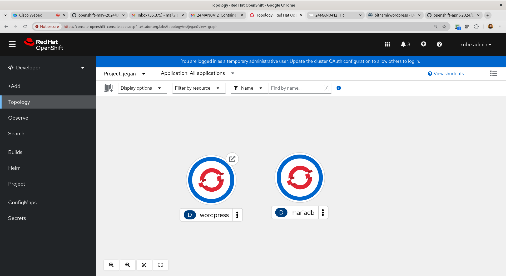
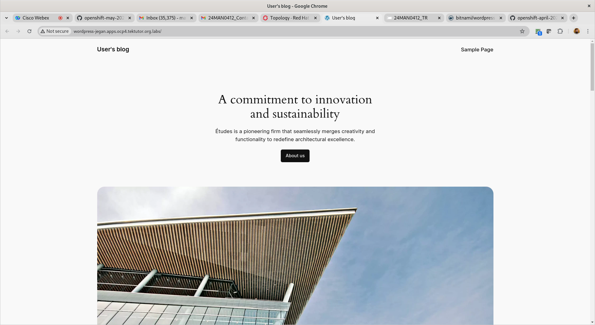

# Day 3

## Info - What is Persistent Volume(PV)?
- Persistent Volume is the disk storage Openshift administrators create with cluster-wide access
- Persistent Volume is an external disk storage
- this can be NFS storage, AWS EBS, AWS S3, Azure Storage, etc.,
- Administrators can provision many Persistent volumes manually


## Info - What is Persistent Volume Claim(PVC)?

## Lab - Deploying mariadb db server with persistent volume and claims
```
cd ~/openshift-may-2024
git pull
cd Day3/persistent-volume/mariadb

oc apply -f pv.yml
oc apply -f pvc.yml
oc apply -f mariadb-deploy.yml
```

Expected output
<pre>
[jegan@tektutor.org persistent-volume]$ ls
mariadb-deploy.yml  pvc.yml  pv.yml
  
[jegan@tektutor.org persistent-volume]$ oc apply -f pv.yml 
persistentvolume/mariadb-pv-jegan created
  
[jegan@tektutor.org persistent-volume]$ oc get persistentvolumes
NAME               CAPACITY   ACCESS MODES   RECLAIM POLICY   STATUS      CLAIM   STORAGECLASS   REASON   AGE
mariadb-pv-jegan   100Mi      RWO            Retain           Available      
  7s
[jegan@tektutor.org persistent-volume]$ oc get persistentvolume
NAME               CAPACITY   ACCESS MODES   RECLAIM POLICY   STATUS      CLAIM   STORAGECLASS   REASON   AGE
mariadb-pv-jegan   100Mi      RWO            Retain           Available                                   8s
  
[jegan@tektutor.org persistent-volume]$ oc get pv
NAME               CAPACITY   ACCESS MODES   RECLAIM POLICY   STATUS      CLAIM   STORAGECLASS   REASON   AGE
mariadb-pv-jegan   100Mi      RWO            Retain           Available      
</pre>

Getting inside the mariadb pod shell, type 'root@123' when it prompts for password below
```
oc rsh deploy/mariadb

mysql -u root -p
SHOW DATABASES;
CREATE DATABASE tektutor;
USE tektutor;

CREATE TABLE training ( id INT NOT NULL, name VARCHAR(250) NOT NULL, duration VARCHAR(250) NOT NULL, PRIMARY KEY (id) );
INSERT INTO training VALUES ( 1, "DevOps", "5 Days" );
INSERT INTO training VALUES ( 2, "Linux Driver Development", "5 Days" );
INSERT INTO training VALUES ( 3, "Advanced Linux Internals", "5 Days" );
SELECT * FROM training;
exit
```

## Lab - Deploying a multi-pod wordpress and mariadb blog web site
You need to edit the yml files and replace 'jegan' with your names before proceeding with the below instructions.

```
cd ~/openshift-may-2024
git pull
cd Day3/peristent-volume/wordpress

./deploy.sh
```

Expected output
<pre>
[jegan@tektutor.org wordpress]$ ls
deploy.sh           mariadb-pv.yml   wordpress-deploy.yml  wordpress-route.yml
mariadb-deploy.yml  mariadb-svc.yml  wordpress-pvc.yml     wordpress-svc.yml
mariadb-pvc.yml     undeploy.sh      wordpress-pv.yml
[jegan@tektutor.org wordpress]$ pwd
/home/jegan/openshift-may-2024/Day3/persistent-volume/wordpress
[jegan@tektutor.org wordpress]$ ./deploy.sh 
\nDeploying mariadb sever ...
persistentvolume/mariadb-pv-jegan created
persistentvolumeclaim/mariadb-pvc-jegan created
deployment.apps/mariadb created
service/mariadb created
\nDeploying wordpress server ...
persistentvolume/wordpress-pv-jegan created
persistentvolumeclaim/wordpress-pvc-jegan created
deployment.apps/wordpress created
service/wordpress created
route.route.openshift.io/wordpress created
Warning: apps.openshift.io/v1 DeploymentConfig is deprecated in v4.14+, unavailable in v4.10000+
NAME                             READY   STATUS              RESTARTS   AGE
pod/mariadb-76d9668b99-9zhsn     0/1     ContainerCreating   0          3s
pod/wordpress-79d484b45f-mnwhc   0/1     ContainerCreating   0          1s

NAME                TYPE        CLUSTER-IP       EXTERNAL-IP   PORT(S)    AGE
service/mariadb     ClusterIP   172.30.171.135   <none>        3306/TCP   3s
service/wordpress   ClusterIP   172.30.238.248   <none>        8080/TCP   1s

NAME                        READY   UP-TO-DATE   AVAILABLE   AGE
deployment.apps/mariadb     0/1     1            0           3s
deployment.apps/wordpress   0/1     1            0           1s

NAME                                   DESIRED   CURRENT   READY   AGE
replicaset.apps/mariadb-76d9668b99     1         1         0       3s
replicaset.apps/wordpress-79d484b45f   1         1         0       1s

NAME                                   IMAGE REPOSITORY                                               TAGS     UPDATED
imagestream.image.openshift.io/nginx   image-registry.openshift-image-registry.svc:5000/jegan/nginx   latest   19 hours ago

NAME                                 HOST/PORT                                     PATH   SERVICES    PORT   TERMINATION   WILDCARD
route.route.openshift.io/wordpress   wordpress-jegan.apps.ocp4.tektutor.org.labs          wordpress   8080                 None  
</pre>

At this point, you should be able to click on the wordpress route url to access the wordpress blog page



Once you are done with is exercise, you can delete the wordpress deployment as shown below
```
cd ~/openshift-may-2024
git pull
cd Day3/persistent-volume/wordpress

./undeploy.sh
```
