# Day 4

## References - You may find some interesting openshift examples here
<pre>
https://github.com/redhat-developer-demos  
</pre>

## Installing Helm package manager in Linux
```
curl -fsSL -o get_helm.sh https://raw.githubusercontent.com/helm/helm/main/scripts/get-helm-3
chmod 700 get_helm.sh
./get_helm.sh
```

## Helm Overview
- a package manager for Kubernetes and Openshift orchestration platforms
- using helm we can package our application as Charts
- our end-users will be able to use the charts we packaged to install into openshift
- helm tool is aware of Kubernetes and Openshift

## Lab - Creating a custom helm package for wordpress and mariadb multi-pod application
```
cd ~/openshift-may-2024
git pull
cd Day4/helm
helm create wordpress-chart
rm -rf wordpress-char/templates/*
#cp yaml-files/* wordpress-chart/templates
ls -l
helm package wordpress-chart
helm install wordpress wordpress-chart-0.1.0.tgz

helm list
```

You may verify if the wordpress and mysql is deployed properly.

## Lab - Deploying redis database with persistent volume
```
oc new-app --name=redis -e REDIS_PASSWORD=pass@123 bitnami/redis:latest --dry-run -o yaml
oc new-app --name=redis -e REDIS_PASSWORD=pass@123 bitnami/redis:latest --dry-run -o yaml > deploy-redis.yml

cd ~/openshift-may-2024
git pull
cd Day4/redis
oc apply -f redis-pv.yml
oc apply -f redis-pvc.yml
oc apply -f deploy-redis.yml
oc apply -f redis-route.yml

oc rsh deploy/redis

redis-cli -h localhost -p 6379 -a pass@123
set msg 'Hello Redis'
get msg
```

Expected output
<pre>
[jegan@tektutor.org redis]$ oc new-app --name=redis -e REDIS_PASSWORD=pass@123 bitnami/redis:latest --dry-run -o yaml
apiVersion: v1
items:
- apiVersion: image.openshift.io/v1
  kind: ImageStream
  metadata:
    annotations:
      openshift.io/generated-by: OpenShiftNewApp
    creationTimestamp: null
    labels:
      app: redis
      app.kubernetes.io/component: redis
      app.kubernetes.io/instance: redis
    name: redis
  spec:
    lookupPolicy:
      local: false
    tags:
    - annotations:
        openshift.io/imported-from: bitnami/redis:latest
      from:
        kind: DockerImage
        name: bitnami/redis:latest
      generation: null
      importPolicy:
        importMode: Legacy
      name: latest
      referencePolicy:
        type: ""
  status:
    dockerImageRepository: ""
- apiVersion: apps/v1
  kind: Deployment
  metadata:
    annotations:
      image.openshift.io/triggers: '[{"from":{"kind":"ImageStreamTag","name":"redis:latest"},"fieldPath":"spec.template.spec.containers[?(@.name==\"redis\")].image"}]'
      openshift.io/generated-by: OpenShiftNewApp
    creationTimestamp: null
    labels:
      app: redis
      app.kubernetes.io/component: redis
      app.kubernetes.io/instance: redis
    name: redis
  spec:
    replicas: 1
    selector:
      matchLabels:
        deployment: redis
    strategy: {}
    template:
      metadata:
        annotations:
          openshift.io/generated-by: OpenShiftNewApp
        creationTimestamp: null
        labels:
          deployment: redis
      spec:
        containers:
        - env:
          - name: REDIS_PASSWORD
            value: pass@123
          image: ' '
          name: redis
          ports:
          - containerPort: 6379
            protocol: TCP
          resources: {}
  status: {}
- apiVersion: v1
  kind: Service
  metadata:
    annotations:
      openshift.io/generated-by: OpenShiftNewApp
    creationTimestamp: null
    labels:
      app: redis
      app.kubernetes.io/component: redis
      app.kubernetes.io/instance: redis
    name: redis
  spec:
    ports:
    - name: 6379-tcp
      port: 6379
      protocol: TCP
      targetPort: 6379
    selector:
      deployment: redis
  status:
    loadBalancer: {}
kind: List
metadata: {}  

[jegan@tektutor.org redis]$ oc apply -f redis-pv.yml 
persistentvolume/redis-pv-jegan created
[jegan@tektutor.org redis]$ oc apply -f redis-pvc.yml 
persistentvolumeclaim/redis-pvc-jegan created
[jegan@tektutor.org redis]$ oc apply -f deploy-redis.yml 
imagestream.image.openshift.io/redis created
deployment.apps/redis created
service/redis created

[jegan@tektutor.org redis]$ oc get svc
NAME    TYPE        CLUSTER-IP      EXTERNAL-IP   PORT(S)    AGE
redis   ClusterIP   172.30.29.107   <none>        6379/TCP   20s
[jegan@tektutor.org redis]$ oc expose svc/redis --dry-run=client -o yaml 
apiVersion: route.openshift.io/v1
kind: Route
metadata:
  creationTimestamp: null
  labels:
    app: redis
    app.kubernetes.io/component: redis
    app.kubernetes.io/instance: redis
  name: redis
spec:
  port:
    targetPort: 6379-tcp
  to:
    kind: ""
    name: redis
    weight: null
status: {}
[jegan@tektutor.org redis]$ oc expose svc/redis --dry-run=client -o yaml > redis-route.yml
[jegan@tektutor.org redis]$ oc apply -f redis-route.yml 
route.route.openshift.io/redis created

jegan@tektutor.org redis]$ oc rsh deploy/redis
$ ls
bin  bitnami  boot  dev  entrypoint.sh	etc  home  lib	lib64  media  mnt  opt	proc  root  run  run.sh  sbin  srv  sys  tmp  usr  var

$ redis-cli -h localhost -p 6379 -a
Unrecognized option or bad number of args for: '-a'
$ redis-cli -h localhost -p 6379 -a pass@123
Warning: Using a password with '-a' or '-u' option on the command line interface may not be safe.
localhost:6379> set msg 'Hello Redis'
OK
localhost:6379> get msg
"Hello Redis"
localhost:6379> exit
$ exit
</pre>


## Lab - Deploying an Angularjs application into openshift

Navigate to Developer Context
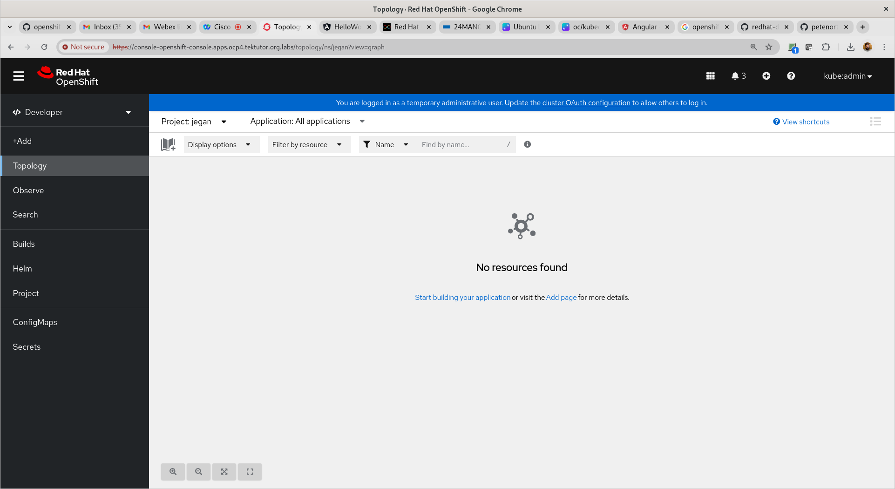

Click on Add menu
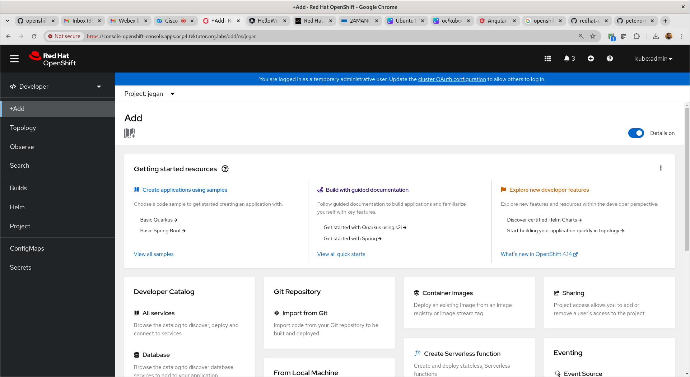

Click on "Import From Git"
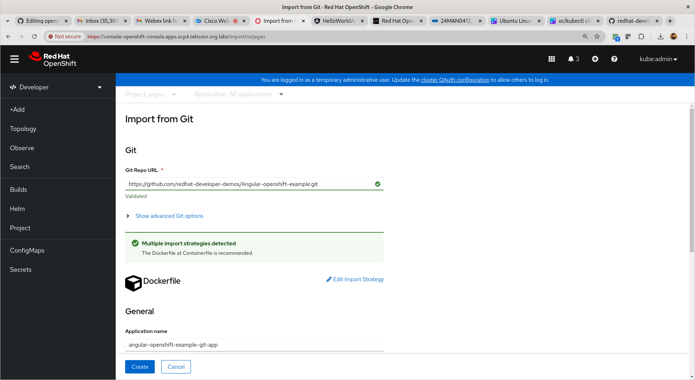

Type this as GitHub url 
<pre>
https://github.com/redhat-developer-demos/Angular-openshift-example.git
</pre>
Under "Resource Type" make sure you selected "Deployment".

Other options, you may Accept all defaults and scroll down to click the "Create" button.
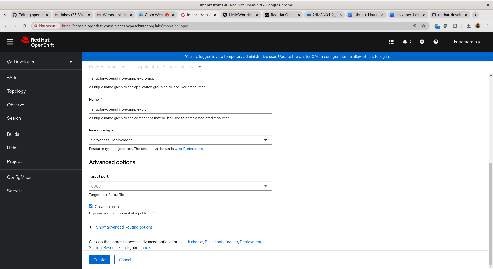
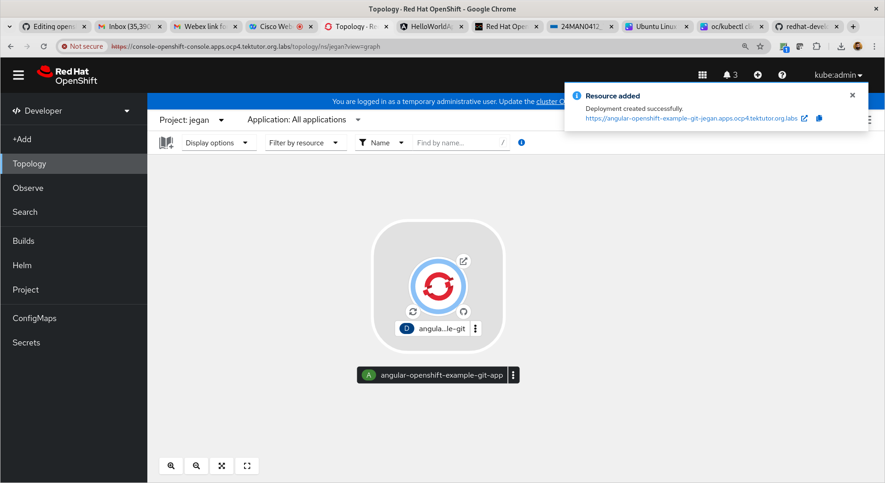
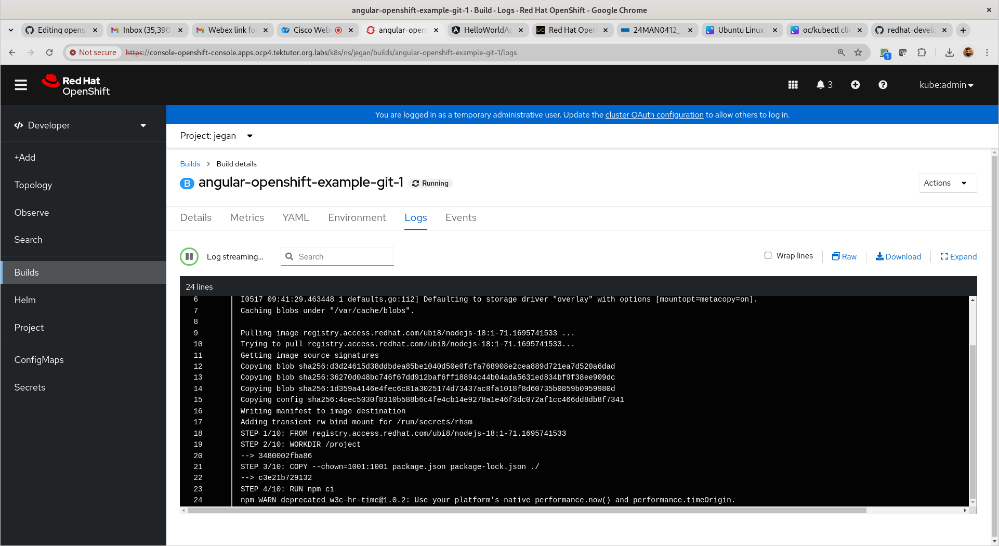
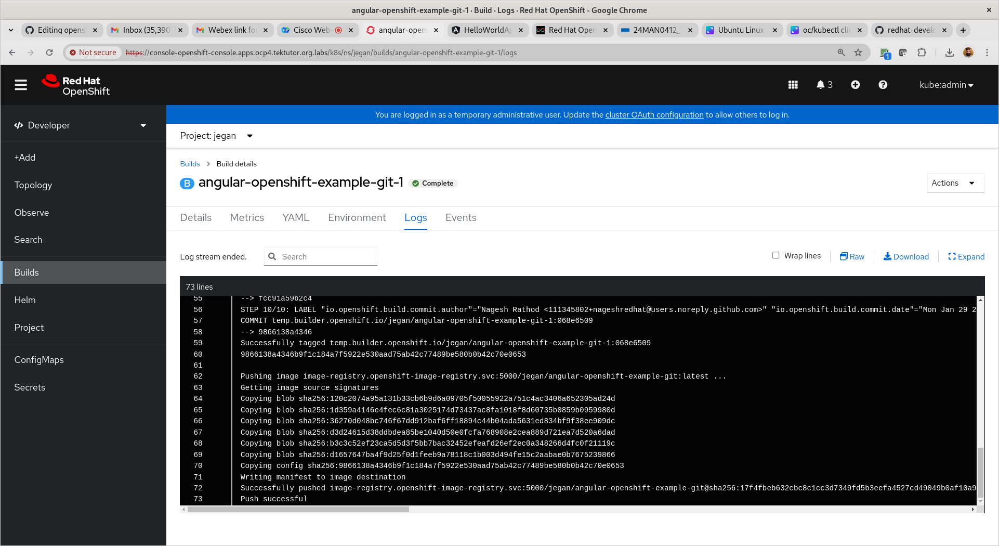
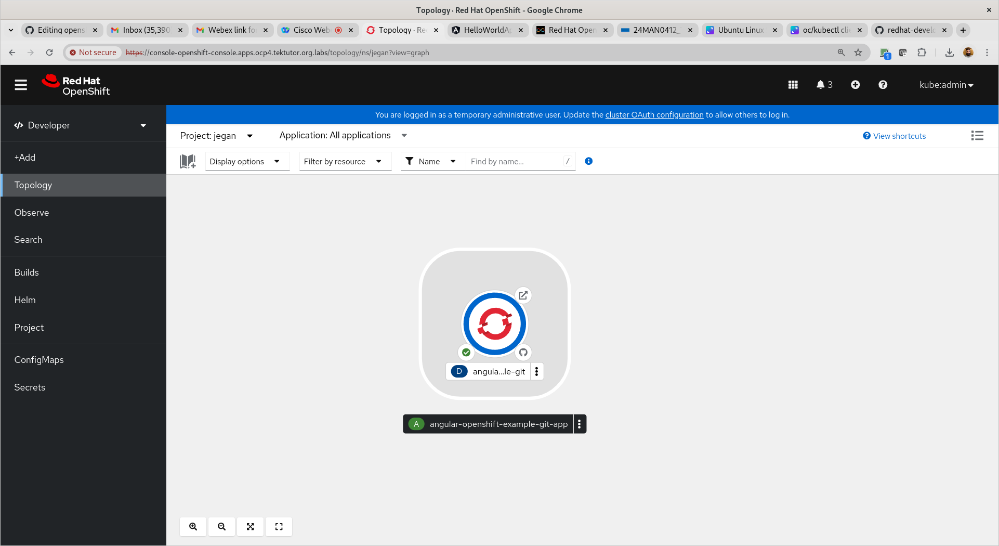
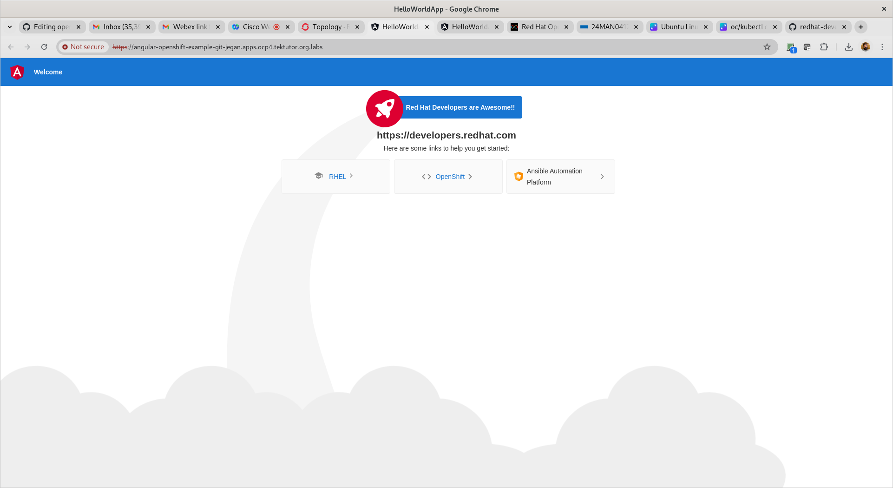

## Lab - Deploying a sample reactjs application into openshift

First navigate to Developer context.
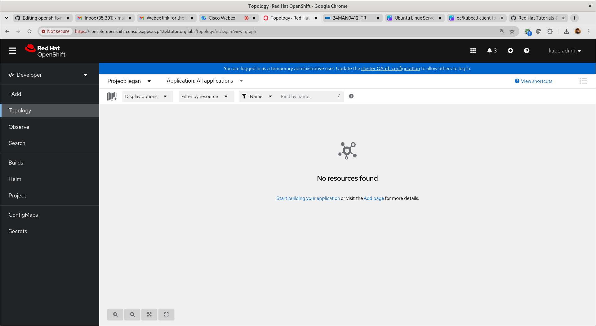

Click on "Add" menu
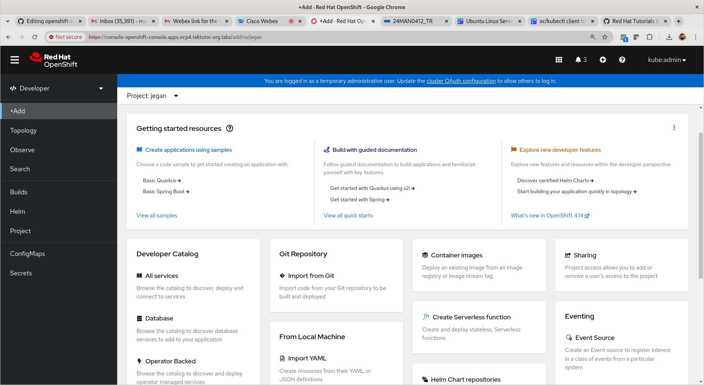

We need to click on "All Services" Under "Developer Catalog"
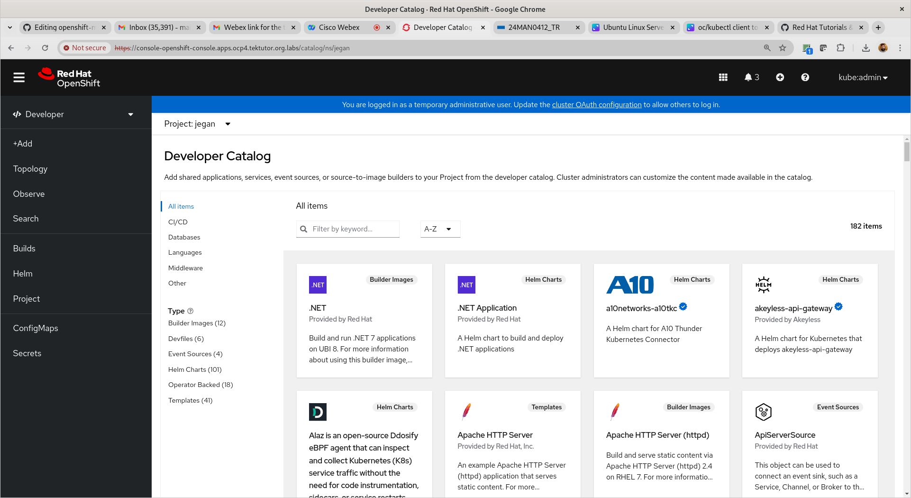

Click on "Languages" Under "All Items"


Under the "Language Search option" type "react"
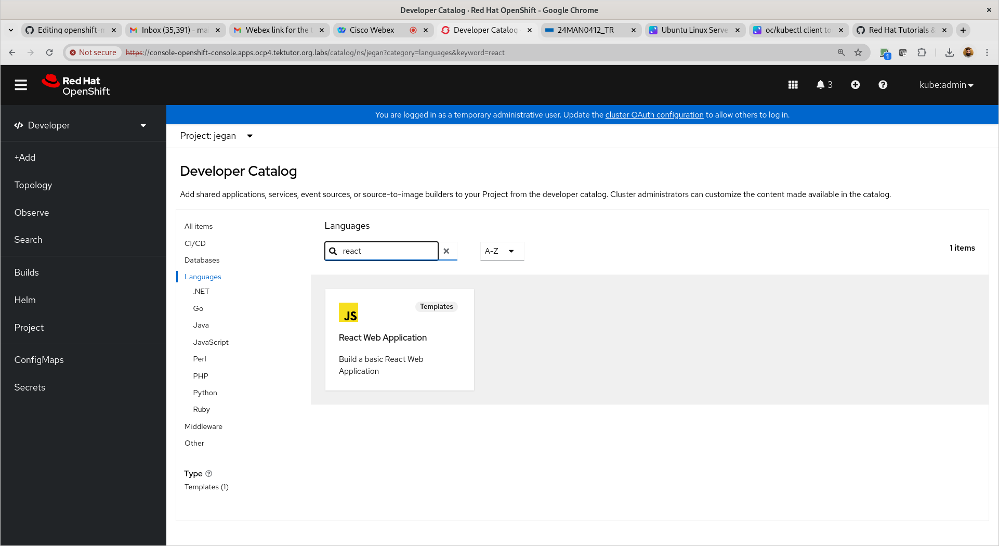

Select the "React Web Application" Template
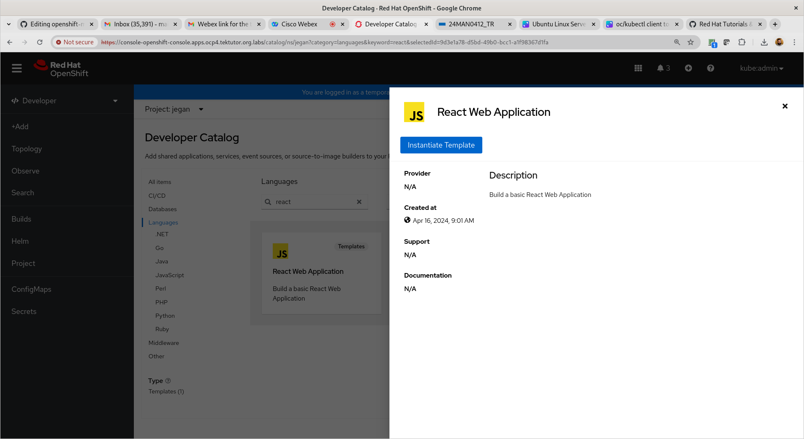

Click on "Instantiate Template"


Scroll down and click on "Create" button
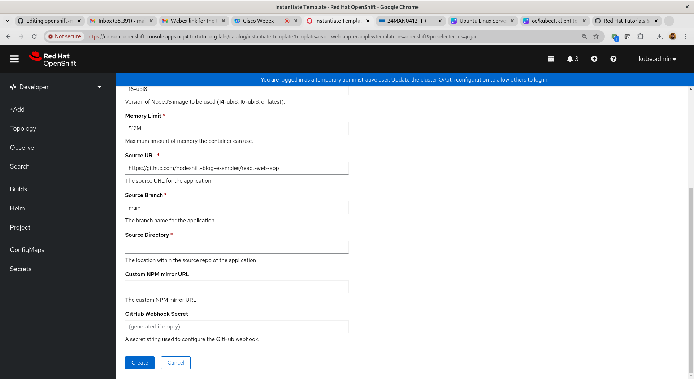
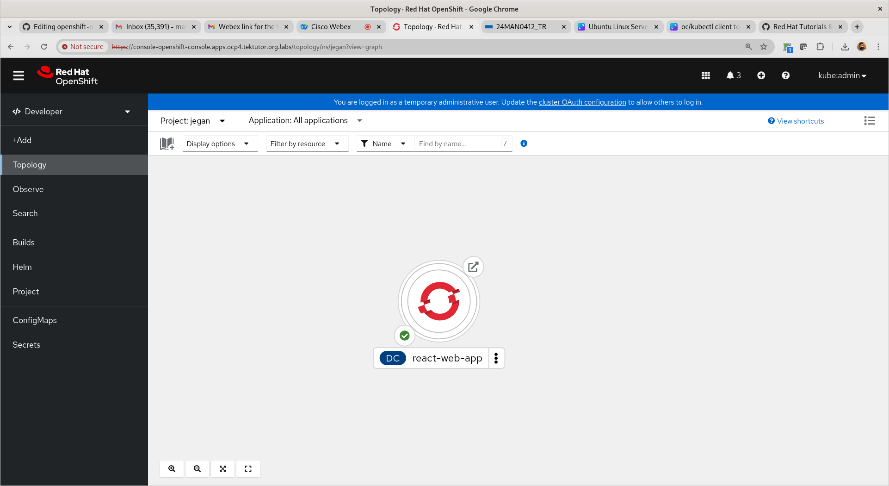
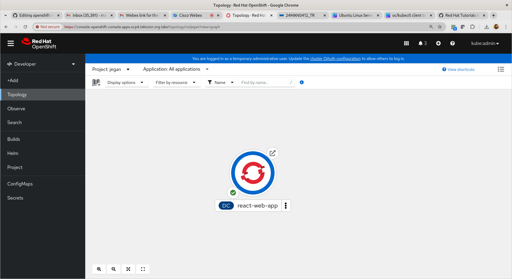

## Lab - Edge route
You can secure your routes with https(secured) as url as opposed to http(unsecured).

## Lab - Create an edge route (https based public route url)

Find your base domain of your openshift cluster
```
oc get ingresses.config/cluster -o jsonpath={.spec.domain}
```

Expected output
<pre>
[root@tektutor.org auth]# oc get ingresses.config/cluster -o jsonpath={.spec.domain}
apps.ocp.tektutor.org.labs	
</pre>

Installing openssl from source code ( Already installed on Lab machines, so kindly skip this installation)
```
sudo yum -y remove openssl openssl-devel
sudo yum groupinstall 'Development Tools'
sudo yum install perl-IPC-Cmd perl-Test-Simple -y
cd /usr/src
wget https://www.openssl.org/source/openssl-3.0.0.tar.gz
tar -zxf openssl-3.0.0.tar.gz
rm openssl-3.0.0.tar.gz
cd /usr/src/openssl-3.0.0
./config
make
make test
make install

sudo ln -s /usr/local/lib64/libssl.so.3 /usr/lib64/libssl.so.3
sudo ln -s /usr/local/lib64/libcrypto.so.3 /usr/lib64/libcrypto.so.3

sudo ldconfig
sudo tee /etc/profile.d/openssl.sh<<EOF
export PATH=/usr/local/bin:$PATH
export LD_LIBRARY_PATH=/usr/local/openssl/lib:/usr/local/openssl/lib64:\$LD_LIBRARY_PATH
EOF

which openssl
openssl version
```

Let's deploy a microservice and create an edge route as shown below.

First, let's generate a private key
```
openssl genrsa -out key.key
```

We need to create a public key using the private key with specific with your organization domain
```
openssl req -new -key key.key -out csr.csr -subj="/CN=hello-jegan.apps.ocp.tektutor.org.labs"
```

Sign the public key using the private key and generate certificate(.crt)
```
openssl x509 -req -in csr.csr -signkey key.key -out crt.crt
oc create route edge --service spring-ms --hostname hello-jegan.apps.ocp4.tektutor.org.labs --key key.key --cert crt.crt
```

Expected output
<pre>
[jegan@tektutor.org edge-route]$ oc get svc
NAME        TYPE        CLUSTER-IP      EXTERNAL-IP   PORT(S)    AGE
spring-ms   ClusterIP   172.30.208.33   <none>        8080/TCP   87m
[jegan@tektutor.org edge-route]$ oc expose deploy/nginx --port=8080
service/nginx exposed
  
[jegan@tektutor.org edge-route]$ oc get svc
NAME        TYPE        CLUSTER-IP      EXTERNAL-IP   PORT(S)    AGE
nginx       ClusterIP   172.30.16.165   <none>        8080/TCP   4s
spring-ms   ClusterIP   172.30.208.33   <none>        8080/TCP   87m

[jegan@tektutor.org edge-route]$ oc get ingresses.config/cluster -o jsonpath={.spec.domain}
apps.ocp4.tektutor.org.labs
  
[jegan@tektutor.org edge-route]$ oc project
Using project "jegan-devops" on server "https://api.ocp4.tektutor.org.labs:6443".
  
[jegan@tektutor.org edge-route]$ openssl req -new -key key.key -out csr.csr -subj="/CN=nginx-jegan-devops.apps.ocp4.tektutor.org.labs"
  
[jegan@tektutor.org edge-route]$ openssl x509 -req -in csr.csr -signkey key.key -out crt.crt
  
[jegan@tektutor.org edge-route]$ oc create route edge --service nginx --hostname nginx-jegan-devops.apps.ocp4.tektutor.org.labs --key key.key --cert crt.crt
route.route.openshift.io/nginx created
  
[jegan@tektutor.org edge-route]$ oc get route
NAME    HOST/PORT                                        PATH   SERVICES   PORT    TERMINATION   WILDCARD
nginx   nginx-jegan-devops.apps.ocp4.tektutor.org.labs   nginx      <all>   edge          None
</pre>

## Info - About Flannel Pod Networking in Kubernetes/OpenShift
<pre>
https://github.com/mvallim/kubernetes-under-the-hood/blob/master/documentation/kube-flannel.md  
</pre>

