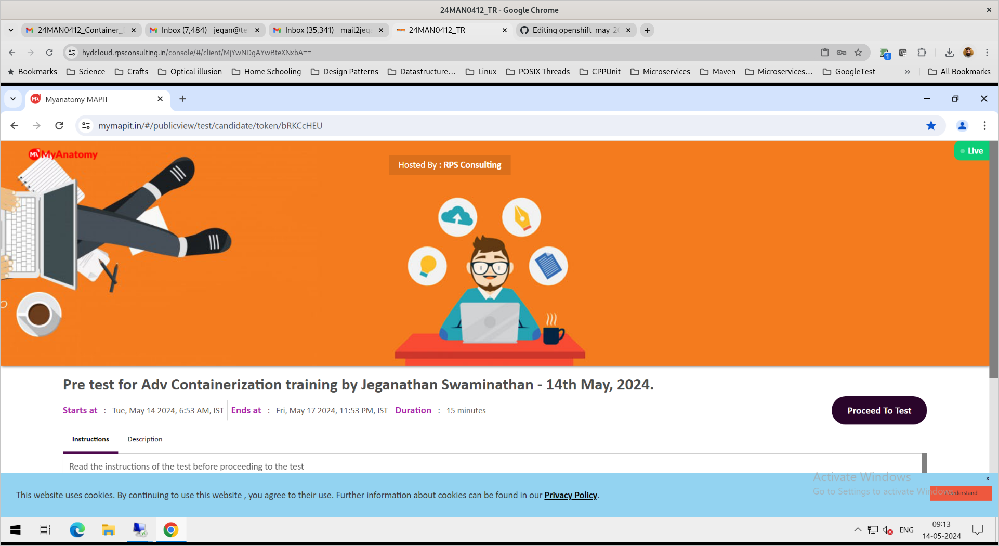

# openshift-may-2024

## About our lab environment
- OnPrem Production grade Red Hat OpenShift setup
  
- System Configuration
  - 48 virtual cores
  - 755 GB RAM
  - 17 TB HDD Storage
- CentOS 7.9.2009 64-bit OS
- KVM Hypervisor
  
- 7 Virtual machines
  - Master 1 with RHEL Core OS ( 8 Cores, 128GB RAM, 500 GB HDD )
  - Master 2 with RHEL Core OS ( 8 Cores, 128GB RAM, 500 GB HDD )
  - Master 3 with RHEL Core OS ( 8 Cores, 128GB RAM, 500 GB HDD )
  - Worker 1 with RHEL Core OS ( 8 Cores, 128GB RAM, 500 GB HDD )
  - Worker 2 with RHEL Core OS ( 8 Cores, 128GB RAM, 500 GB HDD )
  - HAProxy Load Balancer Virtual Machine
  - One more VM is created and destroyed during Openshift installation (BootStrap Virtual Machine)
    
- OS1 - Linux Server 1 ( 10.10.15.102 ) - Openshift cluster 1 ( 7 participants - user01 thru user07 )
- OS2 - Linux Server 2 ( 10.10.15.103 ) - Openshift cluster 2 ( 7 participants - user08 thru user14 )
- OS3 - Linux Server 3 ( 10.10.15.101 ) - openshift cluster 3 ( 7 participants - user15 thru user21 )

- In case you RPS cloud login username is 24MAN0412_01, then you should login to your respective Linux server as user01 with password 'rps@12345' to the Server 1 (10.10.15.102).

- In case you cloud login username 24MAN0412_14, then you should login as user14 with password 'rps@12345' to the Server 2 (10.10.15.103).

- In case your RPS cloud login username is 24MAN0113-21, then you should login to your respective Linux server as user21 with password 'rps@12345' to the Server 3 (10.10.15.101).

## Kindly login to your RPS Lab machine and proceed with the test
The pre-test URL is kept open on the lab machine web browser for your convenience.

#### Note 
- Kindly use your personal email-id for pre-test registration (avoid using BOFA id)
- Copy/Paste between your machine and lab machine is disabled as per your Bank policy
